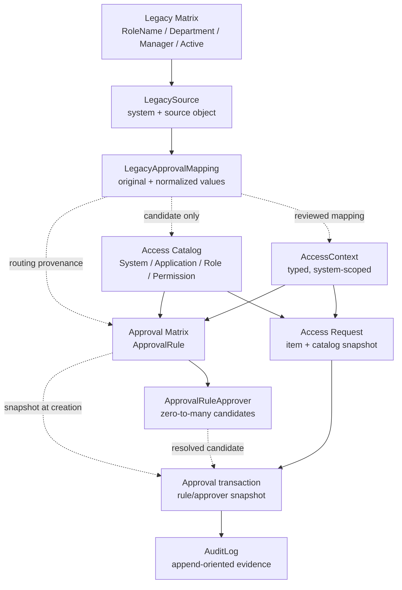

# Access Catalog and Approval Rule Data Model

## Scope and safety

Task 07D refines only the schema of the **NEW ACCESS MANAGEMENT PORTAL**. It does not import legacy rows, apply a migration, connect Prisma to any database, expose an API, connect the UI, or change the current production workflow.

The design is grounded in the sanitized Task 07C findings. The legacy Product Management matrices remain read-only reference sources and are not assumed to be an enterprise access catalog.

## Three separate responsibilities

| Responsibility | Portal models | Meaning |
| --- | --- | --- |
| Access Catalog | `System`, `Application`, `AccessContext`, `Role`, `Permission`, `RolePermission` | Describes access that the portal may eventually request. |
| Approval Matrix | `ApprovalRule`, `ApprovalRuleApprover` | Describes which approver candidates are associated with a department, catalog target, context, and level. It does not yet define ANY/ALL/sequential behavior. |
| Legacy Mapping | `LegacySource`, `LegacyApprovalMapping`, plus `ExternalReference` for stable external object identifiers | Preserves provenance and unresolved source values without turning a legacy matrix row directly into a catalog entitlement. |

Keeping these responsibilities separate prevents a legacy manager-routing label from silently becoming provisionable access.

## Access Catalog

The catalog hierarchy remains generic:

```text
System
  -> optional Application / access resource
      -> Role
          -> zero or more Permissions through RolePermission
```

- `System` is the target platform.
- `Application` can represent a module or access resource when a system needs that level. Systems without it can attach roles directly to the system.
- `Role` is scoped by system, optional application, and optional `AccessContext`.
- `Permission` remains optional and granular. A system that exposes only roles needs no permission rows.
- `ExternalReference` can map `entityType = ROLE` and a portal role ID to a future connector-side entitlement identifier. This avoids connector-specific columns and stores no credentials.

`Role.name` is not globally unique. The schema uniqueness boundary is:

```text
System + optional Application + optional AccessContext + Role.code
```

Application services must normalize catalog codes before persistence and verify that a role, application, permission, and context all belong to the selected system. No Product Management-specific field exists in the catalog.

## Source and context

`AccessContext` is a system-scoped, typed namespace with `contextType`, `code`, and `name`. It can later represent an approved country, region, business unit, tenant, project, or another system-specific boundary without adding columns or hard-coding `NEW`, `TH`, `PH`, or `VN_MY_ID`.

`LegacySource` separately records where legacy values came from:

- source system;
- table, view, file, or other source object;
- optional mapped portal system;
- optional confirmed `AccessContext`.

Source and business context are intentionally not the same field. Task 07C proves that source context matters, but it does not prove that each table code is a country or define what `NEW` means. A `LegacySource.contextId` remains null until that meaning is reviewed.

## Approval Matrix

`ApprovalRule` represents versioned routing configuration. It selects:

- a required department and system;
- optional application, role, and context;
- an approval level;
- an optional legacy source;
- active/effective dates.

`ApprovalRuleApprover` contains the approver candidates for a rule. One rule can have any number of active approver rows, so Department + Role + Context is not constrained to one manager.

Each approver row has:

- an `approverReference`, which may be a normalized legacy reference or a stable portal reference;
- an optional `approverId` only after identity resolution to a portal `User`;
- an optional `sequence`;
- an active state.

`sequence` records ordering only when later evidence defines it. A null value deliberately expresses that ordering is unknown. The schema does not infer whether multiple candidates require ANY, ALL, sequential, or another decision rule. That behavior belongs to a later Approval Engine design.

Rules use `ruleCode + version + approvalLevel` uniqueness. This allows one logical, versioned route to contain multiple approval levels. A material rule change should create a new version rather than rewriting the meaning of an already-used rule.

## Approver identity resolution

The intended future resolution path is:

```text
Original legacy Manager string
  -> normalized comparison value
  -> reviewed identity-resolution result
  -> optional ApprovalRuleApprover.approverId
  -> Entra-backed portal User
```

The original manager string remains only in `LegacyApprovalMapping.originalManagerReference` for traceability. It is not an authoritative identity and does not grant approval rights. No real manager value is imported or resolved in Task 07D.

## Legacy traceability

`LegacyApprovalMapping` is a staging/mapping record rather than a copy of the source table. It stores only the four observed source values, their normalized comparison forms, provenance, resolution status, and optional links to reviewed portal entities.

It can answer:

| Question | Field |
| --- | --- |
| Which legacy platform and table/view supplied it? | `LegacySource.sourceSystem`, `LegacySource.sourceObject` |
| Which source row supplied it? | nullable `sourceRecordKey`; optional non-authoritative `sourceRecordFingerprint` |
| What did the source contain? | `originalRoleName`, `originalDepartment`, `originalManagerReference`, `originalActiveValue` |
| How was it interpreted for comparison? | the corresponding `normalized*` fields |
| What did reviewers map it to? | optional system, role, department, context, rule, and rule-approver relations |

No stable matrix primary key has been confirmed. Therefore `sourceRecordKey` is nullable and no uniqueness constraint pretends that a fingerprint is a source key. Duplicate-looking source rows remain representable.

`ExternalReference` remains the correct mechanism for stable SharePoint, Azure DevOps, or future connector identifiers attached to portal-owned entities. It is not used to fabricate a stable key for legacy matrix rows.

## Import normalization rules

Any future, separately approved import must apply these rules only in the portal boundary:

1. Preserve the received source value in the matching `original*` field when traceability requires it.
2. Trim leading and trailing whitespace to produce a normalized candidate.
3. Convert an empty result to null.
4. Compare candidate labels case-insensitively using an explicit, reviewed normalization strategy.
5. Map candidates to canonical entities only after ambiguity and ownership review.
6. Never clean or update the source table.

Normalized labels are matching aids, not identity or authorization proof.

## Request and approval history

`AccessRequest` continues to identify requester, target user, reason, type, and status. Each `AccessRequestItem` selects a system plus optional application, role, permission, and context. `catalogSnapshot` is serialized JSON reserved for the immutable, non-secret catalog labels and codes captured when a request is submitted.

`Approval` remains a transaction record, not configuration. It may reference the rule version that produced it, while `ruleSnapshot` and `approverSnapshot` retain the reviewed, non-secret decision context. Editing or retiring a later rule cannot change an existing approval status, approver, comment, timestamps, or snapshots. Foreign keys use `NoAction`, and future services must version rules and treat completed approvals and audit events as immutable.

## Conceptual flow



The dotted arrows require future business review; they are not automated imports.

## Unresolved business questions

- What does the `NEW` source represent?
- Are `TH`, `PH`, and `VN_MY_ID` countries, regions, legal entities, operational markets, or another context?
- When several managers match Department + Role + Context, is approval ANY, ALL, sequential, conditional, or something else?
- Does `RoleName` identify provisionable access, a request label, an approval-routing category, or a mixture?
- What authoritative identifiers and matching rules resolve a legacy `Manager` string to an Entra/portal user?
- What is the complete `Active` vocabulary and lifecycle meaning outside the capped Task 07C samples?
- What stable source key, if any, can identify a legacy matrix row?

These questions must be answered before migration, request routing, approval execution, connector provisioning, or production API exposure.
