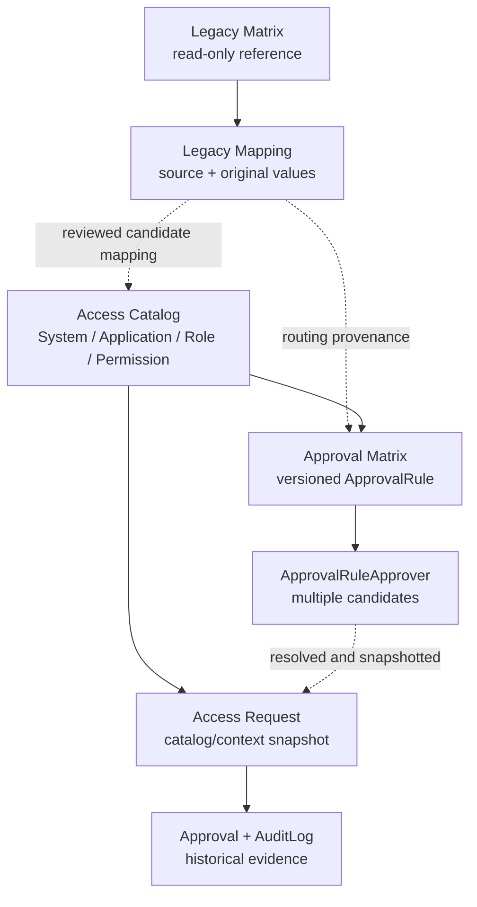

# Architecture

## Scope

This phase creates a local, deployable-in-the-future code layout without creating infrastructure or connecting to any external system. Azure DevOps / VSTS is the first planned pilot, but its current contract is query-only.

This document describes the **NEW ACCESS MANAGEMENT PORTAL** architecture. The working **CURRENT PRODUCTION SYSTEM** is a separate architecture domain and remains unchanged. Its components, workflow, correlation identifiers, legacy SQL sources, and safety boundary are documented in [Existing System Architecture Baseline](existing-system.md).

## Logical view

```text
Employee browser
      |
      v
React web application
      |
      v
Azure Functions API  ----> New portal Azure SQL database (future)
      |
      +----> Read-only connector boundary
                 |----> Azure DevOps / VSTS (future)
                 |----> SharePoint (future)
                 `----> Existing SQL Server (future)

Microsoft Entra ID will authenticate users at the web and API boundaries.
```

The initial skeleton activated no integration. Task 07E later activates only the explicitly approved, Admin-only, bounded legacy SQL read path; SharePoint and Azure DevOps remain unconnected and every write capability remains disabled.

## Components

### `apps/web`

A React single-page application built by Vite. Its Task 05A authentication adapter uses MSAL for redirect login/logout, current-user state, and silent API access-token acquisition. Components consume the adapter rather than MSAL directly. Placeholder configuration leaves the application in an explicit unconfigured state.

Task 06 adds a responsive authenticated shell with React routing, reusable page/table/status components, and role-aware navigation for Admin, Approver, and Viewer. The shell verifies the current identity through `/api/auth/me` before using roles for navigation. This client-side visibility is a user-experience feature only; API authorization remains authoritative. Every displayed business record is synthetic local mock data.

### `apps/api`

An Azure Functions TypeScript application using the v4 programming model. Its anonymous health endpoint has no dependency on authentication, a database, a cloud resource, or a legacy system. Task 05B wires injectable bearer-token validation to `/api/auth/me` and the Admin-only `/api/auth/admin-test`. These return safe identity test data only and are not business endpoints.

Task 07E adds `GET /api/legacy/matrix` and `GET /api/legacy/matrix/summary`. Both reuse the Entra validator, require `Admin`, validate the fixed source allowlist and bounded limit before constructing the lazy legacy service, mask manager values, and return safe errors. Task 07F consumes them from an Admin-only Access Catalog section.

Task 07G adds backend-only `GET /api/legacy/user-requests`. It reuses the same guarded connector and Admin authorization, reads a fixed minimal projection from the legacy User Request SQL table, and returns normalized bounded summaries without person, free-text, or infrastructure fields. It does not add a UI, detail lookup, persistence, migration, or production feedback path.

Task 07I adds Admin-only `GET /api/legacy/user-requests/{idSharepoint}`. The
handler normalizes a numeric SharePoint external identifier, fails closed with
`TOP (2)` when snapshot uniqueness is violated, reads at most 50 related VSTS
backup rows through the confirmed request-origin reference, and returns a
privacy-minimized detail plus an observational lifecycle. SharePoint
`StatusVSTS` and VSTS `State` remain separate and may be reported as matching,
mismatching, or unknown. There is no Portal database, SharePoint API, or VSTS
API dependency in this path.

Task 07J adds no route and does not change the Task 07I DTO. It contributes only
pure count-based semantic analysis and fixed aggregate legacy SQL query
builders. The evidence model labels findings `CONFIRMED`, `LIKELY`, `UNKNOWN`,
or `CONTRADICTED`; it is documentation and discovery support, not an approval,
authorization, provisioning, or lifecycle rule engine. Production discovery
uses the same central SELECT-only guard and emits no request or Work Item IDs.

Task 07K adds an Admin-only React route at
`/legacy-requests/:idSharepoint`. It consumes the existing Task 07I GET endpoint
through `AuthApiClient` and the existing MSAL access-token abstraction. The
view presents request, approval, legacy status, related VSTS, comparison, and
lifecycle fields as independent source observations. It adds no backend route,
legacy field, write control, persistence, source API call, or workflow logic.
See [Legacy User Request Detail UI](legacy-user-request-detail-ui.md).

### `packages/contracts`

Framework-neutral TypeScript types shared across boundaries. Keeping transport contracts separate prevents frontend code from importing server or database implementation details.

### `packages/shared`

Cross-cutting safety configuration. Legacy integration settings are parsed with a fail-closed policy: the only accepted mode is `READ_ONLY`, and every capability flag must be the exact value `false`.

### `packages/connectors`

Ports for legacy integrations. Interfaces expose read operations only and intentionally contain no create, update, delete, provision, revoke, or automation methods. Task 07A adds an `mssql`-based legacy SQL adapter, a SELECT-only guard, and a fixed Product Management matrix allowlist. Task 07E constructs it lazily only after successful Admin authorization and parameter validation; builds, health checks, and automated tests make no database connection.

Task 07J keeps that port query-only and adds aggregate builders limited to the
fixed User Request and VSTS backup tables. They project only status, reference,
type, and time evidence; person and free-text columns remain outside the SQL
projection. Synthetic analysis utilities return counts/classifications without
identifiers or timestamp values.

### `database`

A Prisma schema targeting SQL Server for a future, dedicated portal database. It does not describe, introspect, or migrate the existing production SQL Server. The normalized design is documented in [Access Management Portal Data Model V1](data-model.md); no migration has been created or run.

Task 04 adds a reusable environment-configured Prisma client plus repository interfaces and Prisma implementations for the portal-owned entities. Minimal API services depend on those interfaces and are assembled in an API composition root. The health endpoint remains independent of this container, so startup health checks perform no database I/O.

The implementation flow is API service to repository interface to Prisma repository to the new portal database. Legacy systems use a separate read-only connector boundary and never pass through the portal Prisma repositories. See [Local Development Data Layer](data-access.md).

## Task 07D data-model boundaries

Task 07D refines the portal-owned schema around three independent concerns:

- **Access Catalog** describes systems, optional applications/access resources, context-scoped roles, and permissions.
- **Approval Matrix** uses versioned `ApprovalRule` records with zero-to-many `ApprovalRuleApprover` candidates. It does not infer ANY, ALL, or sequential semantics.
- **Legacy Mapping** records source provenance, original/normalized comparison values, and optional reviewed destinations. A legacy matrix row is never automatically a catalog role or an approval transaction.

`AccessContext` is a typed, system-scoped concept and is separate from `LegacySource`. This prevents table labels such as `NEW`, `TH`, `PH`, and `VN_MY_ID` from being asserted as country meanings before business confirmation.



No arrow activates an import, approval engine, connector, or production write. See [Access Catalog and Approval Rule Data Model](access-catalog-data-model.md).

## Data ownership

- The existing platform remains authoritative throughout the pilot.
- The future portal database is a separate bounded store owned by this application.
- Legacy data will be read through explicit connector interfaces, not through shared ORM models.
- No migration from the existing system is authorized in this phase.

## Dependency direction

Applications may depend on packages. `connectors` may depend on `contracts`; contracts do not depend on applications, infrastructure SDKs, or Prisma. This keeps domain boundaries testable and prevents infrastructure code from leaking into the frontend.

## Future decision points

Before any live integration, the team must approve identity flows, authorization roles, network boundaries, audit retention, connector permissions, data classification, and a production-read validation plan. Enabling writes requires a separate project phase and security review; changing an environment variable alone is not sufficient authorization.
