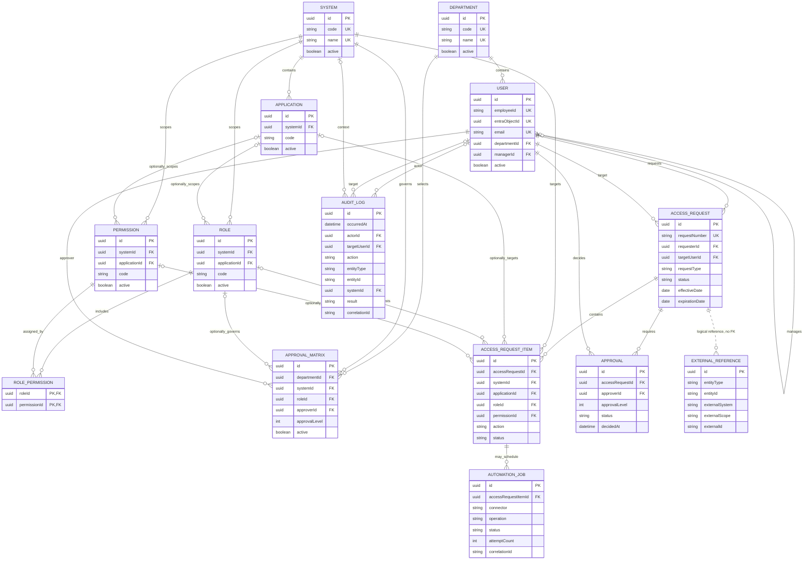

# Access Management Portal Data Model V1

## Scope and safety

This is the logical and Prisma schema design for the **new Access Management Portal database**. It is not a model of the existing SharePoint list or legacy SQL schema and does not authorize data migration.

Task 03 is local database design only:

- no production or legacy database was connected;
- no migration, introspection, push, or seed command was run;
- no SharePoint, Azure DevOps / VSTS, Power Automate, or Azure resource was accessed or changed;
- all legacy integrations remain read-only;
- the seed fixture is synthetic and non-executable.

The source of truth for this design is [`database/schema/schema.prisma`](../database/schema/schema.prisma).

## Design principles

1. **Normalize business concepts.** Users, organization, access catalog, requests, approvals, integration references, jobs, and audit events have separate responsibilities.
2. **Avoid the 51-column legacy shape.** A request contains any number of request items rather than adding one column per target system or access type.
3. **Keep the catalog generic.** `System`, optional `Application`, optional `Role`, and optional `Permission` levels support Azure DevOps, WMS, OMS, and future systems without system-specific columns.
4. **Keep legacy identity outside core tables.** `ExternalReference` stores extensible correlations instead of adding permanent `sharepointId`, `vstsWorkItemId`, `wmsId`, or `omsId` fields.
5. **Preserve history.** Requests and approvals are transactional records; `AuditLog` is append-oriented and contains actor and before/after context.
6. **Separate design from execution.** `AutomationJob` reserves a durable execution record for a later connector framework but performs no automation in Task 03.
7. **Prevent accidental cascades.** Relations use `NoAction`, which avoids SQL Server multiple-cascade-path problems and requires deliberate lifecycle handling.

## SQL Server compatibility decisions

The datasource remains `provider = "sqlserver"` for a future dedicated Azure SQL database.

Prisma's SQL Server connector does not support Prisma `enum` declarations or Prisma `Json` fields. To keep the schema valid:

- request types, statuses, actions, operations, connector codes, entity types, and result codes use bounded `NVARCHAR` fields;
- allowed vocabularies are documented below and must be validated at API/domain boundaries;
- flexible structured values use serialized JSON in `NVARCHAR(MAX)` fields;
- a later migration design may add SQL `CHECK` constraints or promote changing vocabularies to reference tables after review.

This compromise retains SQL Server compatibility without introducing a large collection of premature lookup tables.

### Coded value vocabulary

| Field | Initial values |
| --- | --- |
| `AccessRequest.requestType` | `ADD`, `REMOVE`, `CHANGE` |
| `AccessRequest.status` | `DRAFT`, `SUBMITTED`, `PENDING_APPROVAL`, `APPROVED`, `REJECTED`, `CANCELLED`, `IN_PROGRESS`, `COMPLETED`, `FAILED` |
| `AccessRequestItem.action` | `ADD`, `REMOVE`, `CHANGE` |
| `AccessRequestItem.status` | `PENDING`, `APPROVED`, `REJECTED`, `QUEUED`, `IN_PROGRESS`, `COMPLETED`, `FAILED`, `CANCELLED` |
| `Approval.status` | `PENDING`, `APPROVED`, `REJECTED`, `CANCELLED` |
| `AutomationJob.operation` | `GET_ACCESS`, `ADD_ACCESS`, `REMOVE_ACCESS`, `VERIFY_ACCESS` |
| `AutomationJob.status` | `PENDING`, `RUNNING`, `SUCCEEDED`, `FAILED`, `CANCELLED` |
| `AuditLog.result` | `SUCCESS`, `FAILURE`, `DENIED` |

Connector, external-system, entity-type, and audit-action codes remain strings because they are extension points rather than closed vocabularies.

## Entity descriptions

### User and organization

| Entity | Responsibility |
| --- | --- |
| `Department` | Stable organizational unit identified by a unique code and name. An `active` flag supports soft retirement without deleting historical relationships. |
| `User` | Employee identity linked to Entra ID, department, and an optional manager. `employeeId`, `entraObjectId`, and `email` are unique. Passwords are never stored. The manager/direct-report relationship is self-referencing. |

### Access catalog

| Entity | Responsibility |
| --- | --- |
| `System` | Top-level access target such as Azure DevOps, WMS, OMS, EPOD, or Grafana. |
| `Application` | Optional module within a system. A system that has no module layer does not need application rows. |
| `Role` | Named access role scoped to a system and optionally an application. A null `applicationId` represents a system-level role. |
| `Permission` | Granular entitlement scoped to a system and optionally an application. Systems without granular entitlements do not need permission rows. |
| `RolePermission` | Many-to-many mapping between roles and their granular permissions. |

The schema deliberately has no fields such as `vstsRole`, `wmsRole`, or `omsPermission`.

### Approval policy and decisions

| Entity | Responsibility |
| --- | --- |
| `ApprovalMatrix` | Future normalized approval policy keyed by department, system, optional role, approver, and approval level. Multiple rows allow sequential levels and multiple approvers at a level. |
| `Approval` | Request-specific approval decision. It records the approver, level, status, optional comment, and decision timestamp independently of the policy that selected the approver. |

`ApprovalMatrix` is configuration; `Approval` is transaction history. Changing a matrix must not rewrite approvals already attached to requests.

### Requests

| Entity | Responsibility |
| --- | --- |
| `AccessRequest` | Business request header containing its unique request number, requester, target user, request type, reason, effective/expiration dates, overall status, and optional serialized metadata. |
| `AccessRequestItem` | One requested access change within a request. Every item selects a system and may select an application, role, permission, or combination appropriate to that system. It stores action, current/requested serialized values, and item status. |

One request may contain multiple items across one or more systems. This is the main structural difference from the wide SharePoint record.

### Integration, execution, and audit

| Entity | Responsibility |
| --- | --- |
| `ExternalReference` | Polymorphic correlation from a portal entity to an identifier in SharePoint, Azure DevOps, or another external system. `externalScope` distinguishes organizations, projects, sites, or lists where identifiers may overlap. |
| `AutomationJob` | Future execution record attached to an access-request item. It tracks connector, operation, state, attempts, timestamps, error, and correlation ID; no connector is implemented here. |
| `AuditLog` | Append-oriented security and business audit event containing event time, actor snapshot and optional actor user, optional target user/system, action, target entity, before/after serialized values, result, connector, error, and correlation ID. |

## Important relationships and invariants

- A `Department` has many users and approval-matrix rows.
- A user may have one manager and many direct reports.
- A `System` has optional applications and contains roles and permissions directly or through those applications.
- `RolePermission` resolves the many-to-many role/permission relationship.
- An `AccessRequest` belongs to one requester and one target user and contains many items and approval decisions.
- Every request item targets one system; application, role, and permission are optional.
- An approval matrix row selects one approver at one level for a department/system and optional role.
- An automation job belongs to exactly one request item.
- Audit events may refer to portal users and systems but retain string snapshots/codes for durable interpretation.
- `ExternalReference` is intentionally polymorphic and therefore has no physical foreign key to each possible entity table. The service layer must validate `entityType`/`entityId` before insertion.

Because optional catalog levels retain their own foreign keys, domain validation must also ensure that an item's application, role, and permission belong to its selected system, and that each `RolePermission` links compatible catalog scopes. This invariant must be tested before request features are implemented.

## Mermaid ER diagram



The `ExternalReference` line is dotted because it is a logical polymorphic relationship, not a database foreign key.

## Legacy-to-new conceptual mapping

This table is design guidance only. No legacy records are migrated in Task 03.

| Legacy concept | New conceptual destination | Notes |
| --- | --- | --- |
| SharePoint Item ID | `ExternalReference` | `entityType = ACCESS_REQUEST`, `externalSystem = SHAREPOINT`, and `externalId` contains the item ID. `externalScope` should identify the approved site/list scope without embedding it in the schema. |
| SharePoint `Work_ID` | `ExternalReference(AZURE_DEVOPS)` | Associates the request with the VSTS work item ID. It does not become a permanent request column. |
| VSTS `Custom_IDSharepoint` | Same SharePoint `ExternalReference` correlation | Used only for read/reconciliation analysis in Phase 1; the portal must not update it. |
| `Topic_Request` | `AccessRequest.requestType` and optional request metadata | Map to `ADD`, `REMOVE`, or `CHANGE` only when semantics match; retain unmatched source context as serialized metadata after an approved mapping design. |
| Manager Name | `Approval.approver` | Resolve to a portal `User`; never preserve a display-name string as the authoritative identity. |
| Status Manager | `Approval.status` | Requires an explicit, reviewed legacy-status mapping. |
| `MatrixProductManagement_*` | Future `ApprovalMatrix` migration | Department, system, role, approver, approval level, and active state are normalized. No migration occurs in this task. |

The legacy matrices remain reference data and are not treated as a complete enterprise role/access catalog.

## ExternalReference strategy

`ExternalReference` prevents schema expansion for every new connector:

```text
Access Request AR-000001 -> SHAREPOINT / approved-scope / 1433
Access Request AR-000001 -> AZURE_DEVOPS / approved-scope / 870093
```

The uniqueness constraint on `(externalSystem, externalScope, externalId)` prevents one scoped external object from being mapped to multiple portal entities. The `(entityType, entityId)` index supports retrieval of all external references for a portal record.

Optional `externalUrl` is a navigation hint only and must not contain embedded credentials. Optional `metadata` is serialized JSON for non-authoritative connector context; searchable business fields belong in normalized columns instead.

## Audit strategy

`AuditLog` is intentionally append-oriented:

- it has an event timestamp but no `updatedAt` field;
- actor text is retained as an immutable snapshot while `actorId` optionally links to a portal user;
- before/after values are serialized JSON snapshots, with secrets and unnecessary personal data excluded;
- `entityType` plus `entityId` identifies the affected portal record;
- connector and correlation ID connect audit events to future jobs and distributed request traces;
- indexes support timeline, actor, target-user, entity, system, and correlation searches.

Application and database permissions must eventually deny update/delete operations on audit records. Prisma schema structure alone cannot guarantee append-only behavior.

## Indexing and constraints

- Unique indexes cover employee ID, Entra object ID, email, department/system codes, and request number.
- Request indexes cover overall status, requester, target user, and creation time.
- Item indexes cover request, status, system, application, role, and permission lookups.
- Approval indexes cover request/level/status and approver queues.
- Catalog indexes cover system, optional application scope, role, and active state.
- External-reference indexes cover both portal-entity and external-system lookups.
- Automation and audit indexes cover status, timestamps, and correlation IDs.
- Foreign keys use `NoAction`; historical records cannot disappear through an accidental cascade.

## Future Joiner/Mover/Leaver compatibility

The same request structure supports future JML workflows without adding employee-lifecycle columns to each connector:

- **Joiner:** one `ADD` request can contain multiple items for baseline access across systems, with effective dates and ordered approvals.
- **Mover:** one `CHANGE` request can combine `ADD`, `REMOVE`, and `CHANGE` items to represent department or responsibility changes.
- **Leaver:** one `REMOVE` request can contain all known access items, schedule removal, and later attach verification jobs.
- `User.departmentId`, `User.managerId`, and `ApprovalMatrix` support organization-aware approval routing.
- `AutomationJob` can later execute and verify each item independently.
- `ExternalReference` can correlate HR, ticketing, and target-system identifiers without new columns.
- `AuditLog` supplies the durable evidence needed for reconciliation, access reviews, and governance.

No JML engine, connector execution, provisioning, revocation, or verification is implemented in Task 03.

## Local seed fixture

[`database/seed/development.seed.json`](../database/seed/development.seed.json) provides obviously synthetic departments, users, systems, applications, roles, permissions, role-permission mappings, and a sample approval-matrix row. It includes Azure DevOps, WMS, OMS, Reader, Contributor, and Administrator examples.

The fixture is declarative and has no loader, so it cannot connect to or write any database in this task.
