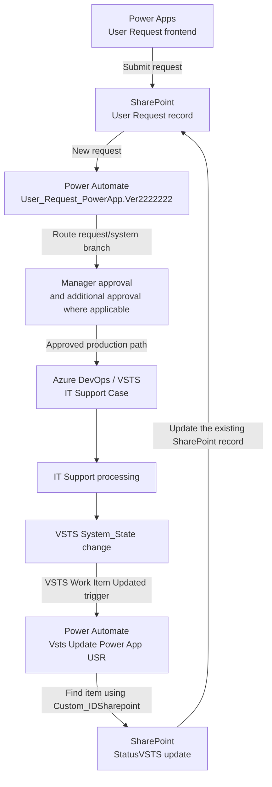
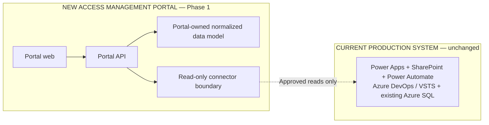

# Existing System Architecture Baseline

## Purpose and scope

This document records the currently understood production **User Request** architecture. It is a baseline for discovery and future design; it is not an authorization to change, replace, call, migrate, or reconfigure any production component.

Two architecture domains must remain distinct:

- **CURRENT PRODUCTION SYSTEM** — the working Power Apps, SharePoint, Power Automate, Azure DevOps / VSTS, and existing Azure SQL solution described below.
- **NEW ACCESS MANAGEMENT PORTAL** — the separately owned application in this repository. During Phase 1 it may only introduce explicitly approved read-only integrations and must use its own normalized data model.

The production system continues to perform its existing writes as part of its established operation. The read-only restriction applies to every integration introduced by the new portal and to all project discovery or validation activity.

## CURRENT PRODUCTION SYSTEM

The current User Request solution remains operational and authoritative. The new portal must not interrupt its request intake, approval, case creation, status synchronization, reporting, or integration behavior.

### Production components

| Component | Current responsibility | Data or behavior relevant to this baseline |
| --- | --- | --- |
| Power Apps | Existing User Request frontend | Users submit access and service requests. |
| SharePoint | User Request record store | Stores request information, approval status, `Work_ID`, VSTS status, timestamps, assignment information, and legacy detail. |
| Power Automate: `User_Request_PowerApp.Ver2222222` | Main request orchestration | Processes new SharePoint requests, selects request/system branches, coordinates manager and additional approvals, sends email/Teams notifications, performs SQL operations for some request types, creates VSTS `IT Support Case` work items, and stores SharePoint/VSTS correlation. |
| Azure DevOps / VSTS | IT Support work tracking | Uses work item type `IT Support Case`. IT Support processes the case and changes its state through the existing operating process. |
| Power Automate: `Vsts Update Power App USR` | VSTS-to-SharePoint status synchronization | Triggered when a VSTS work item is updated; identifies User Request work items, reads `Custom_IDSharepoint`, locates the SharePoint item, and updates SharePoint `StatusVSTS` from VSTS `System_State`. |
| Existing Azure SQL | Legacy, reporting, and integration data | Includes `dbo.All_SharepointUserRequest`, `dbo.All_Azure_Dev(VSTS)`, and Product Management approval matrices. These are legacy read-only sources for the new portal. |

### End-to-end production workflow

1. A user submits an access or service request through Power Apps.
2. SharePoint stores the User Request record and its workflow metadata.
3. `User_Request_PowerApp.Ver2222222` processes the new SharePoint request and determines the applicable request/system branch.
4. The flow coordinates manager approval and, where applicable, IT Manager or other additional approval.
5. The flow sends the applicable email or Teams notifications and performs existing SQL operations for request types that require them.
6. The flow creates an Azure DevOps / VSTS work item of type `IT Support Case`.
7. The production process stores correlation identifiers in SharePoint and VSTS.
8. IT Support processes the `IT Support Case` and changes its VSTS state.
9. A VSTS work-item update triggers `Vsts Update Power App USR`.
10. That flow identifies the related User Request, reads `Custom_IDSharepoint`, locates the SharePoint item, and copies VSTS `System_State` into SharePoint `StatusVSTS`.

The workflow below documents existing production behavior. It does not represent code or integrations implemented in this repository.



### SharePoint and VSTS correlation

The production integration records both directions of the relationship:

| Identifier source | Stored in | Field | Meaning |
| --- | --- | --- | --- |
| SharePoint Item ID | VSTS `IT Support Case` | `Custom_IDSharepoint` | Identifies the originating SharePoint User Request item. |
| VSTS Work Item ID | SharePoint User Request | `Work_ID` | Identifies the associated VSTS `IT Support Case`. |

Conceptually:

```text
SharePoint Item ID <-> VSTS Custom_IDSharepoint
VSTS Work Item ID   <-> SharePoint Work_ID
```

Future read-only discovery may use these identifiers for matching and reconciliation analysis. The new portal must not populate, repair, or update either side during Phase 1.

### Existing Azure SQL legacy sources

The current Azure SQL environment contains legacy, reporting, and integration tables including:

- `dbo.All_SharepointUserRequest`
- `dbo.All_Azure_Dev(VSTS)`

For the new portal these tables are reference sources only. Phase 1 does not authorize schema introspection against production, data copying, migration, stored-procedure execution, or any `INSERT`, `UPDATE`, `DELETE`, `MERGE`, or DDL operation.

### Product Management approval matrices

The existing Product Management matrices include:

- `dbo.MatrixProductManagement_new`
- `dbo.MatrixProductManagement_TH`
- `dbo.MatrixProductManagement_PH`
- `dbo.MatrixProductManagement_VN_MY_ID`

The known matrix shape is:

| Column | Baseline interpretation |
| --- | --- |
| `RoleName` | Legacy role or approval-mapping label |
| `Manager` | Manager value used by the legacy mapping process |
| `Department` | Department dimension used by the mapping process |
| `Active` | Legacy active/inactive indicator |

These tables primarily behave as approval and role-mapping matrices. They must not be treated as a complete enterprise Role & Access Catalog, an authoritative entitlement inventory, or the normalized data model for the new portal. Any later mapping into portal concepts requires separate profiling, ownership confirmation, and design approval.

## NEW ACCESS MANAGEMENT PORTAL

The portal is a separate application boundary. Its web application, API, data model, and future connector framework do not replace the current production workflow during Phase 1.

### Phase 1 migration principle

- The existing production workflow remains unchanged and operational.
- Every new portal integration with a legacy system is read-only.
- Existing SQL tables and Product Management matrices remain legacy source/reference data.
- The new portal owns a separate, normalized data model rather than modifying or adopting legacy tables as its operational schema.
- No request routing, approval, notification, work-item creation, status update, provisioning, revocation, or automation is transferred to the portal.



The dotted line is a policy boundary, not an implemented connection. No production connector exists in the repository at this stage.

### Later phases — future scope, not authorized by this baseline

The following capabilities are roadmap candidates only. Each requires its own requirements, security review, data ownership decisions, test plan, and explicit implementation authorization:

- New Request Engine
- Approval Engine
- Connector Framework
- Azure DevOps provisioning
- Verification
- Reconciliation
- Joiner/Mover/Leaver
- Access Review
- Governance

Listing these phases does not authorize Task 03 or any implementation work.

## Production Safety Boundary

The required Phase 1 controls are:

```dotenv
ENABLE_SHAREPOINT_WRITE=false
ENABLE_LEGACY_SQL_WRITE=false
ENABLE_VSTS_WRITE=false
ENABLE_ACCESS_PROVISIONING=false
ENABLE_ACCESS_REVOCATION=false
ENABLE_AUTOMATION=false
```

In addition, `LEGACY_INTEGRATION_MODE` remains `READ_ONLY`.

These flags document and enforce the application-side default, but they are not sufficient on their own. Any future production reader must also use a technically read-only identity and least-privilege source permissions.

The project must not:

- create, update, or delete SharePoint records;
- modify, close, or create VSTS work items;
- write to, migrate, or change the existing Azure SQL database;
- alter or trigger either Power Automate flow;
- provision or revoke access;
- create or store production credentials, tokens, tenant secrets, PATs, usernames, or passwords;
- deploy any resource or application as part of this task.

## Baseline gaps requiring later confirmation

This baseline intentionally does not infer details that were not provided. Before designing a live read-only integration, confirm through an approved, non-invasive discovery process:

- the exact SharePoint site, list, column types, and retention rules;
- every branch and approval condition in `User_Request_PowerApp.Ver2222222`;
- the complete `IT Support Case` field mapping and relevant VSTS state values;
- the filtering rule used by `Vsts Update Power App USR` to identify User Request work items;
- the schemas, ownership, refresh behavior, and consumers of the listed Azure SQL tables;
- authoritative ownership and interpretation of each Product Management matrix;
- error handling, retry, duplicate, and partial-failure behavior across the current correlations.

Until confirmed, these are unknowns rather than assumptions.
