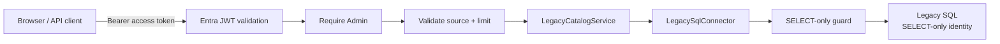

# Admin-only Legacy Matrix Read API

## Scope

Task 07E exposes two Azure Functions routes for controlled, bounded reads of the four approved Product Management matrix sources. Task 07F consumes those routes from the Access Catalog UI without importing data, persisting an audit record, running a migration, or enabling any write/provisioning/automation capability.

The Azure Functions routes use `authLevel: anonymous` only because Microsoft Entra bearer-token validation and role authorization are implemented inside the API. The handlers independently require a valid access token and the `Admin` application role.

## Request flow



Authentication, authorization, and input validation complete before the runtime legacy service is created. Connector construction is lazy, and SQL connectivity is not required by builds or automated tests.

## Routes

### `GET /api/legacy/matrix`

Example:

```http
GET /api/legacy/matrix?source=NEW&limit=3
```

Query rules:

| Parameter | Rule |
| --- | --- |
| `source` | Required exactly once. Allowed: `NEW`, `TH`, `PH`, `VN_MY_ID`. |
| `limit` | Optional exactly once. Default 20, minimum 1, maximum 50. Non-integer and out-of-range values return 400. |

Any other query parameter is rejected. Callers cannot provide table names, SQL text, column lists, filters, or ordering. The accepted source key is mapped internally by the connector to a fixed table allowlist, and the limit remains a bound parameter.

The response contains `source`, `rowsRead`, `limit`, and bounded rows. Role, department, and active strings are trimmed; blank values become null. Manager values are returned only as `managerMasked` using the existing Task 07C masking function. Raw manager values are not returned or logged.

### `GET /api/legacy/matrix/summary`

Example:

```http
GET /api/legacy/matrix/summary?source=NEW
```

`source` follows the same allowlist. The endpoint rejects other query parameters and analyzes at most 50 rows through `LegacyCatalogService`.

The response deliberately uses sample terminology:

- `sampleSize`;
- `sampleLimit`;
- `sampleDistinctRoleCount`;
- `sampleDistinctDepartmentCount`;
- `sampleDistinctManagerCount`;
- aggregate active patterns and data-quality/relationship counts.

`sampleSize` is the number of rows read for this bounded request. It is not a table row count and must not be presented as exhaustive profiling.

## Authentication and authorization

- Missing or invalid bearer access token: 401 with a generic error code.
- Valid user without `Admin`: 403.
- `Viewer` and `Approver` alone are not sufficient.
- UI visibility is irrelevant; authorization is enforced by the backend.
- The existing Entra issuer, audience, signature, lifetime, tenant, and `access_as_user` validation is reused. No second authentication mechanism is introduced.

## Access Catalog Web integration

The Access Catalog contains a `Legacy Role Matrix` section with an explicit `READ ONLY` badge. Admin users can select `NEW`, `TH`, `PH`, or `VN_MY_ID` and request either 20 or 50 rows. The Web calls only:

- `GET /api/legacy/matrix?source=<SOURCE>&limit=<LIMIT>`;
- `GET /api/legacy/matrix/summary?source=<SOURCE>`.

The existing MSAL access-token provider and Portal API client are reused. The client displays only response fields defined by the shared contract, including `managerMasked`; it does not unmask managers or perform Graph/identity lookups.

For `Viewer`, `Approver`, or other non-Admin role sets, the section displays an access-required message and does not call either endpoint. This UI check reduces unnecessary requests but is not a security boundary. Both API routes continue to validate the bearer token and require `Admin`.

Loading, empty, unauthenticated, forbidden, unavailable, and success states use fixed user-facing text. Raw backend errors, SQL details, stack traces, tokens, and credentials are never rendered.

## Safe errors and logs

- Invalid input: 400.
- Authentication or legacy SQL configuration unavailable: 503.
- Legacy SQL connection/query unavailable: 503.
- Unexpected error or an internal safety invariant failure: generic 500.

Responses never include server/database/user names, connection strings, SQL text, stack traces, raw driver errors, JWTs, Authorization headers, or employee/manager identities.

Sanitized logs contain only endpoint code, approved source key, requested/sample limit, rows read, and stable result/error code. Task 07E does not write `AuditLog` because the new portal database is not activated.

## Read-only guarantee

The endpoint can call only `LegacyCatalogService.getMatrixRows` or `getMatrixSummary`. Both delegate to `LegacySqlConnector.listProductManagementMatrix`, which:

1. accepts only the four fixed source keys;
2. builds a fixed explicit-column `SELECT TOP (@limit)` query;
3. binds the row limit as a parameter;
4. passes the query through the central SELECT-only guard;
5. uses the separately configured legacy SQL identity.

There is no HTTP route for `executeSelect` and no arbitrary SQL capability. The required safety state remains:

```dotenv
LEGACY_INTEGRATION_MODE=READ_ONLY
ENABLE_LEGACY_SQL_WRITE=false
ENABLE_SHAREPOINT_WRITE=false
ENABLE_VSTS_WRITE=false
ENABLE_ACCESS_PROVISIONING=false
ENABLE_ACCESS_REVOCATION=false
ENABLE_AUTOMATION=false
```

## Automated and controlled testing

Normal automated tests inject authentication and legacy service fakes. They do not load local credentials or contact legacy SQL.

The separately controlled local check is limited to:

- rows: `source=NEW&limit=3`;
- summary: `source=NEW`;
- an authenticated Entra user with the `Admin` role;
- ignored local configuration with the required read-only safety settings.

No full production rows or raw manager values may be recorded in test output or committed files.
