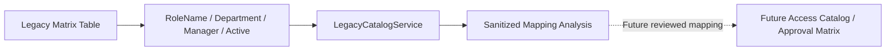

# Legacy Product Management Matrix Discovery

## Scope and safety

Task 07C performed a controlled read-only discovery on 2026-09-04 against only the four approved Product Management matrix sources. Each query selected the explicit `RoleName`, `Manager`, `Department`, and `Active` columns and enforced `TOP (@limit)` with a maximum limit of 50.

No SharePoint, Azure DevOps / VSTS, Power Automate, User Request table, portal database, migration, UI, provisioning, revocation, automation, or deployment was accessed or changed. No production rows, manager identities, credentials, connection strings, or exports are stored in this repository.

## Sources and observed structure

| Source | Fixed table | Sample rows read | Explicit columns confirmed |
| --- | --- | ---: | --- |
| `NEW` | `dbo.MatrixProductManagement_new` | 3 | `RoleName`, `Manager`, `Department`, `Active` |
| `TH` | `dbo.MatrixProductManagement_TH` | 50 (capped) | `RoleName`, `Manager`, `Department`, `Active` |
| `PH` | `dbo.MatrixProductManagement_PH` | 50 (capped) | `RoleName`, `Manager`, `Department`, `Active` |
| `VN_MY_ID` | `dbo.MatrixProductManagement_VN_MY_ID` | 50 (capped) | `RoleName`, `Manager`, `Department`, `Active` |

No stable key was assumed or used. The discovery therefore used capped `TOP (50)` samples without claiming that the three capped sources were fully profiled. The three rows returned by `NEW` are also treated as a point-in-time sample rather than a permanent row-count assertion.

## Sanitized sample summary

| Source | Distinct roles | Distinct departments | Distinct managers | Active patterns |
| --- | ---: | ---: | ---: | --- |
| `NEW` | 3 | 1 | 1 | `ACTIVE`: 3 |
| `TH` | 33 | 24 | 27 | `ACTIVE`: 50 |
| `PH` | 20 | 18 | 23 | `ACTIVE`: 50 |
| `VN_MY_ID` | 16 | 18 | 24 | `ACTIVE`: 50 |

All distinct counts use trimmed, case-insensitive comparison for discovery only. This does not clean or modify source values.

## Data quality observations

No null or blank value was observed in any of the four known columns within these samples. No capitalization-variant group or normalized duplicate row was observed.

Whitespace observations:

| Source | RoleName | Manager | Department | Active |
| --- | ---: | ---: | ---: | ---: |
| `NEW` | 0 | 0 | 0 | 0 |
| `TH` | 0 | 0 | 0 | 0 |
| `PH` | 2 | 1 | 1 | 0 |
| `VN_MY_ID` | 0 | 0 | 1 | 0 |

Relationship ambiguity within each sample:

| Source | Roles with multiple managers | Roles with multiple departments | Department/role pairs with multiple managers |
| --- | ---: | ---: | ---: |
| `NEW` | 0 | 0 | 0 |
| `TH` | 10 | 9 | 4 |
| `PH` | 10 | 9 | 4 |
| `VN_MY_ID` | 8 | 7 | 6 |

These results show that a role label is not a one-to-one approver key. They do not prove the absence of other issues outside the capped samples. Inactive values were not observed, so the complete legacy vocabulary and semantics of `Active` still require source-owner confirmation.

## Cross-source and country context

Case-insensitive, trimmed comparison found:

- 17 role names present in more than one matrix source;
- 31 department/role pairs present in more than one source;
- 13 shared role names associated with multiple manager values across sources.

The actual role, department, and manager values are intentionally not recorded here. The aggregate collisions demonstrate that `RoleName` is not globally unique and that source/country context must remain part of future mapping.

`NEW`, `TH`, `PH`, and `VN_MY_ID` must not be collapsed into one namespace. A future reviewed design should preserve at least `legacySource` and, after business confirmation, explicit `country` or `region` context. A dedicated legacy-mapping/staging entity is preferable to changing the meaning or uniqueness of the normalized portal `Role` directly.

## Conceptual mapping

| Legacy value | Future portal concept | Required mapping behavior |
| --- | --- | --- |
| `RoleName` | `Role` candidate | Stage in `LegacyApprovalMapping`; resolve within source, system, and confirmed `AccessContext`. Do not assume global uniqueness or that it is provisionable. |
| `Department` | `Department` candidate | Trim for comparison while preserving the source value for traceability; resolve aliases through reviewed rules. |
| `Manager` | `ApprovalRuleApprover` candidate | Preserve the original value in `LegacyApprovalMapping`; resolve to an authoritative portal/Entra user later. Never use display text alone as permanent identity. |
| `Active` | Mapping or approval-rule active candidate | Define an explicit source-value mapping after confirming the full legacy vocabulary. |
| Matrix source | `LegacySource` | Preserve the exact source independently of country/region semantics. Associate an `AccessContext` only after confirmation. |

One legacy row is a mapping candidate, not a complete enterprise role or entitlement definition. Multiple rows may legitimately represent different approvers, departments, countries, or approval routes.

## Why no migration is performed

The discovery sample is capped, has no confirmed stable ordering key, and already shows cross-source collisions and one-to-many relationships. Migrating now would risk incorrect role uniqueness, department matching, manager identity resolution, and approval routing.

Task 07C made no Prisma schema change. Task 07D subsequently designed a source-aware mapping model, but still performs no migration or import. Before any migration, the team must confirm table ownership and stable keys, profile complete value vocabularies through a separately authorized process, define identity-resolution rules, and obtain data-owner/security approval.

## Task 07D design response

The new-portal schema now separates:

- `AccessContext` from `LegacySource`, so source labels are preserved without guessing their country meaning;
- catalog `Role` from `LegacyApprovalMapping`, so a matrix label remains only a candidate until reviewed;
- `ApprovalRule` from `ApprovalRuleApprover`, so one Department + Role + Context may retain multiple approver candidates;
- approval configuration from request-specific `Approval` snapshots.

The application-level normalization rule remains trim, blank-to-null, and case-insensitive comparison while preserving original source values. No source value was cleaned, imported, or resolved in Task 07D.

See [Access Catalog and Approval Rule Data Model](access-catalog-data-model.md) for schema rationale, traceability, history, and unresolved business questions.

## Task 07N catalog analysis

The internal catalog preview now reads only RoleName, Department, and Active.
Manager is excluded. Source is preserved as provenance; country, region, and
other context semantics remain UNKNOWN. Repeated role labels are observations,
not an instruction to merge or import. Department is not automatically a Role
identity component, and Active does not trigger any lifecycle action.
See [Legacy catalog mapping](access-catalog-legacy-mapping.md) for versioned
normalization, generated-code collision handling, aggregate findings, and
business decisions required before separate approval analysis.

## Task 07O approval candidate analysis

The approval preview uses the existing four-column bounded read but outputs no
raw Manager strings. Source + role + department is only a hypothetical grouping;
all observations and duplicate approver entries remain representable. Identity,
approval mode and sequence stay unresolved/UNKNOWN. Count-only comparisons of
alternative groupings do not establish business semantics or authority.
See [Approval rule legacy mapping](approval-rule-legacy-mapping.md) for privacy,
catalog linkage, ambiguity counts, and decisions required before Task 07P.
