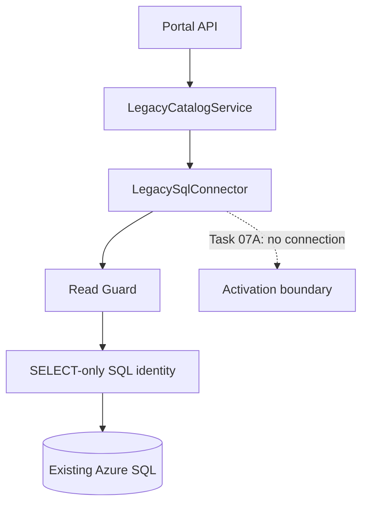

# Legacy SQL Read-Only Connector Foundation

## Purpose and Task 07A scope

This integration boundary prepares the Access Management Portal to read selected legacy Product Management approval matrices in a future, separately approved activation task. Task 07A does not connect to an SQL Server, run a health check, expose an HTTP route, migrate data, or change any production system.

The existing Power Apps, SharePoint, Power Automate, Azure DevOps / VSTS, and Azure SQL workflow remains unchanged. The required safety controls remain:

```dotenv
LEGACY_INTEGRATION_MODE=READ_ONLY
ENABLE_LEGACY_SQL_WRITE=false
```

All other Production Safety Boundary flags also remain false.

## Separation from the portal database

The normalized new-portal database and legacy SQL are different data domains:

- New portal data uses repository interfaces, Prisma, and the dedicated `DATABASE_URL`.
- Legacy data uses `LegacyCatalogService`, `LegacySqlConnector`, a central read guard, and separate `LEGACY_SQL_*` settings.
- Prisma has no models for legacy tables and must never introspect or migrate legacy SQL.
- Legacy matrix rows are nullable source representations, not portal `ApprovalMatrix` records.



No component is constructed at API startup and no automatic connection or query occurs in Task 07A.

## Read-only architecture

`LegacyCatalogService` depends on the read-only connector interface and currently has no API route. `LegacySqlConnector` owns lazy pool creation, parameter binding, SELECT execution, safe pool reuse and close behavior, timeout configuration, and safe error translation. Constructing the connector or its `mssql` adapter does not open a connection.

`healthCheck()` is prepared for future explicit activation and uses only:

```sql
SELECT 1 AS ok
```

It is never called automatically at application startup.

## Defense in depth

The application guard is one layer, not the production security boundary:

```text
Application SELECT-only guard
             +
Dedicated SQL login or identity granted SELECT only
             =
Read-only legacy integration
```

Before any live activation, the database owner must provide a dedicated identity restricted to `SELECT` on approved views or tables. It must have no DML, DDL, stored-procedure execution, ownership, impersonation, or broad database role permissions. Network restrictions, secret storage, monitoring, code review, and change approval remain required.

## Central read guard

Every query reaches `assertLegacySqlReadOnlyQuery` before the driver is asked for a request. The guard:

- permits one plain `SELECT` statement;
- permits a single optional trailing semicolon;
- rejects empty or non-`SELECT` input;
- rejects statement chaining and embedded semicolons;
- rejects line and block comments as bypass surfaces;
- rejects mutation, execution, DDL, permission, backup/restore, diagnostic, `SELECT INTO`, session-changing, wait, and external-query keywords.

The rejected vocabulary includes `INSERT`, `UPDATE`, `DELETE`, `MERGE`, `EXEC`, `EXECUTE`, `DROP`, `ALTER`, `CREATE`, `TRUNCATE`, `GRANT`, `REVOKE`, `DENY`, `BACKUP`, `RESTORE`, and `DBCC`.

String inspection cannot understand every SQL Server behavior. The SELECT-only database identity is therefore mandatory.

## Supported matrix tables and allowlist

Callers select an internal `MatrixSource`; they never supply a table name:

| Matrix source | Fixed SQL identifier |
| --- | --- |
| `NEW` | `dbo.MatrixProductManagement_new` |
| `TH` | `dbo.MatrixProductManagement_TH` |
| `PH` | `dbo.MatrixProductManagement_PH` |
| `VN_MY_ID` | `dbo.MatrixProductManagement_VN_MY_ID` |

Unknown values fail before query execution. HTTP input must never be interpolated into schema, table, column, ordering, or other SQL identifiers.

Rows preserve the known legacy meanings and tolerate nulls:

```ts
interface LegacyProductManagementMatrixRow {
  roleName: string | null;
  manager: string | null;
  department: string | null;
  active: string | null;
}
```

No migration or normalization occurs in the connector.

## Configuration

Future local-only values belong in the ignored `apps/api/local.settings.json` under:

- `LEGACY_SQL_SERVER`
- `LEGACY_SQL_DATABASE`
- `LEGACY_SQL_USER`
- `LEGACY_SQL_PASSWORD`
- `LEGACY_SQL_ENCRYPT` (default `true`)
- `LEGACY_SQL_TRUST_SERVER_CERTIFICATE` (default `false`)
- `LEGACY_SQL_CONNECTION_TIMEOUT_MS` (default `15000`)
- `LEGACY_SQL_REQUEST_TIMEOUT_MS` (default `30000`)

The tracked `apps/api/local.settings.example.json` contains placeholders only. Real server names, users, passwords, and connection strings must never be added to Git. Legacy SQL never uses the new-portal `DATABASE_URL`.

Configuration validation fails closed when required values are missing, placeholders remain, timeouts are invalid, encryption flags are malformed, `LEGACY_INTEGRATION_MODE` is not `READ_ONLY`, or any capability flag is not exactly `false`.

## Parameterization rules

Dynamic values use named `mssql` request parameters. Parameter names must match a conservative identifier pattern and values are passed separately to the driver. Callers must never concatenate user-controlled values into SQL text.

Fixed identifiers cannot be parameterized by SQL Server, so the connector maps its closed `MatrixSource` union to reviewed constant identifiers. Arbitrary identifiers are rejected.

## Errors and logging

Connector errors expose only stable error codes and generic messages. Raw driver errors are not propagated because they may contain hostnames, usernames, connection details, or sensitive values.

The connector must not log:

- passwords or complete connection strings;
- SQL parameter values that may contain employee or other sensitive data;
- tokens, authorization headers, or secrets;
- raw driver errors without an approved sanitizer.

Operational logs may record a safe connector operation name, result, elapsed time, correlation ID, and generic error code.

## Future Task 07B activation

Task 07B must be separately reviewed and authorized before any real connection. At minimum it must:

1. confirm source ownership and the exact approved schemas and columns;
2. provision a dedicated SELECT-only identity outside this repository;
3. store real local values only in ignored `apps/api/local.settings.json` and hosted secrets in an approved secret store;
4. verify network restrictions, encryption, certificate policy, and timeouts;
5. review every query template and its parameterization;
6. add integration tests in a non-production environment;
7. explicitly construct and inject the connector without adding startup queries;
8. protect and authorize any API route, minimize returned employee data, and add safe audit/monitoring;
9. validate that all write flags remain false and that the identity cannot mutate data;
10. obtain change and security approval before production use.

Task 07A does not authorize any of these activation steps.
