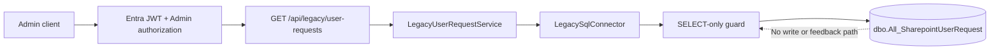

# Legacy User Request Read Integration

## Scope and production boundary

Task 07G adds an on-demand, backend-only read path for:

```text
dbo.All_SharepointUserRequest
```

The table remains a legacy read-only source. No row is imported into the Portal database, no Prisma model or migration is added, and there is no feedback path to SharePoint, Power Automate, or Azure DevOps/VSTS.



The mandatory state remains:

```dotenv
LEGACY_INTEGRATION_MODE=READ_ONLY
ENABLE_SHAREPOINT_WRITE=false
ENABLE_LEGACY_SQL_WRITE=false
ENABLE_VSTS_WRITE=false
ENABLE_ACCESS_PROVISIONING=false
ENABLE_ACCESS_REVOCATION=false
ENABLE_AUTOMATION=false
```

## Safe schema discovery

Schema discovery was performed on 2026-09-04 through the existing `LegacySqlConnector` and central read guard. The connector executed:

- a parameterized `INFORMATION_SCHEMA.COLUMNS` metadata SELECT for the fixed schema and table;
- a parameterized `sys.indexes` metadata SELECT limited to primary and unique indexes.

Both statements were SELECT-only. No business row was read, printed, saved, or committed. The table returned 32 nullable columns. No primary key or unique index was reported, so Task 07G itself did not expose a detail endpoint. Later discovery and the fail-closed Task 07I implementation are documented separately.

The date-related source columns are `varchar`, not SQL date/time values. The API therefore trims them but preserves them as `createdDateText` and `updatedDateText`; it does not guess a format or fabricate ISO timestamps.

## Discovered schema and mapping

`varchar(max)` and `nvarchar(max)` below correspond to metadata length `-1`. Business meanings marked candidate or unknown require confirmation from the data owner and Power Automate owners.

| Legacy column | SQL type | Business meaning | Portal field | Classification | Exposed via API? | Masked? | Notes |
| --- | --- | --- | --- | --- | --- | --- | --- |
| `Type` | `varchar(50)` | Request type candidate | Unavailable | Access request / unknown | No | Omitted | Vocabulary and relationship to `TypeALL` are unconfirmed. |
| `IDSharepoint` | `varchar(50)` | SharePoint request identifier | `externalRequestId` | Identifier | Yes | No | Nullable source text; not treated as a Portal database key. |
| `CreateBy` | `varchar(200)` | Request creator candidate | Unavailable | Person-related | No | Omitted | Excluded from SELECT for data minimization. |
| `CreateDate` | `varchar(200)` | Source creation date text | `createdDateText` | Audit/time | Yes | No | Format not assumed. |
| `RequestEmail` | `varchar(200)` | Requester email candidate | Unavailable | Person-related | No | Omitted | Full email is never selected by the list query. |
| `Company` | `varchar(50)` | Company context | `company` | Organization | Yes | No | Trimmed; blank becomes null. |
| `Department` | `varchar(200)` | Department context | `department` | Organization | Yes | No | Trimmed; no department resolution is performed. |
| `Special_Case` | `varchar(50)` | Special-case indicator candidate | Unavailable | Workflow / unknown | No | Omitted | Semantics unconfirmed. |
| `SystemProgram` | `varchar(200)` | Requested system/program text | `system` | Access request | Yes | No | Not split into System/Application. |
| `TopicRequest` | `nvarchar(1000)` | Request topic candidate | Unavailable | Access request | No | Omitted | May contain free text or PII; vocabulary unconfirmed. |
| `Zone` | `varchar(50)` | Zone/context candidate | Unavailable | Organization / unknown | No | Omitted | Scope semantics unconfirmed. |
| `Permission` | `varchar(150)` | Requested permission text | `permission` | Access request | Yes | No | Not resolved to a Portal Permission record. |
| `Country` | `varchar(100)` | Country context | `country` | Organization | Yes | No | Trimmed; no canonical-country mapping is performed. |
| `Servername` | `varchar(max)` | Server/infrastructure detail candidate | Unavailable | Access request / infrastructure | No | Omitted | Excluded as sensitive infrastructure context. |
| `DBName` | `varchar(max)` | Database detail candidate | Unavailable | Access request / infrastructure | No | Omitted | Excluded as sensitive infrastructure context. |
| `StorageName` | `varchar(max)` | Storage detail candidate | Unavailable | Access request / infrastructure | No | Omitted | Excluded as sensitive infrastructure context. |
| `Tanant` | `varchar(500)` | Tenant/context candidate | Unavailable | Access request / unknown | No | Omitted | Source spelling preserved; semantics unconfirmed. |
| `Detail` | `nvarchar(max)` | Request detail/free text | Unavailable | Unknown/legacy | No | Omitted | Never selected because it may contain PII or secrets. |
| `LineManager` | `varchar(100)` | Manager/approver candidate | Unavailable | Person-related | No | Omitted | Stronger minimization than masking; identity resolution is deferred. |
| `StatusLineManager` | `varchar(100)` | Line-manager approval status | `lineManagerApprovalStatus` | Workflow | Yes | No | Kept separate; not converted to an overall status. |
| `StatusCEOApprove` | `varchar(100)` | CEO/additional approval status | `ceoApprovalStatus` | Workflow | Yes | No | Vocabulary unconfirmed. |
| `StatusITManager` | `varchar(100)` | IT-manager approval status | `itManagerApprovalStatus` | Workflow | Yes | No | Vocabulary unconfirmed. |
| `SQLSpecial_Case` | `varchar(50)` | SQL special-case indicator candidate | Unavailable | Workflow / unknown | No | Omitted | Semantics unconfirmed. |
| `OpenCase` | `varchar(50)` | Case-open indicator candidate | Unavailable | Workflow | No | Omitted | Relationship to VSTS state is unconfirmed. |
| `Work_ID` | `varchar(50)` | Azure DevOps/VSTS Work Item reference | `workItemId` | Identifier | Yes | No | Reference only; Task 07G never calls VSTS. |
| `TypeALL` | `varchar(200)` | Combined request type candidate | Unavailable | Access request / unknown | No | Omitted | Relationship to `Type` and `SubType` is unconfirmed. |
| `SubType` | `varchar(200)` | Request subtype candidate | Unavailable | Access request / unknown | No | Omitted | Vocabulary unconfirmed. |
| `Assign` | `varchar(200)` | Assignment value candidate | Unavailable | Person-related / workflow | No | Omitted | May identify a person or queue. |
| `StatusVSTS` | `varchar(200)` | Mirrored VSTS state | `vstsStatus` | Workflow | Yes | No | Read-only source value; no VSTS lookup occurs. |
| `UpdateDate` | `varchar(100)` | Source update date text | `updatedDateText` | Audit/time | Yes | No | Format not assumed. |
| `SQLReference` | `varchar(50)` | SQL/reference indicator candidate | Unavailable | Identifier / unknown | No | Omitted | Semantics unconfirmed. |
| `IDSHARE_INT` | `int` | Numeric SharePoint ID candidate | Unavailable | Identifier | No | Omitted | Nullable and not backed by a unique index; detail lookup is deferred. |

No explicit columns were discovered for target employee/user, application, role, deleted/active flag, closed date, or one authoritative overall request status.

## Normalized list contract

`LegacyUserRequestSummary` exposes only 13 fields:

- `externalRequestId`, `workItemId`;
- `company`, `department`, `country`;
- `system`, `permission`;
- `lineManagerApprovalStatus`, `ceoApprovalStatus`, `itManagerApprovalStatus`, `vstsStatus`;
- `createdDateText`, `updatedDateText`.

Every source value is trimmed and blank text becomes null. The DTO does not expose a raw database row. It contains no email, employee identifier, phone, creator/manager/assignee identity, free-text description, server, database, storage, or tenant value.

Omitting those columns at the SQL projection is preferred to reading and masking them. If a later approved use case requires a person field, it must define a stable identity source, authorization scope, masking rule, and privacy review before changing this projection.

## API

### `GET /api/legacy/user-requests`

The only supported query parameter is `limit`:

| Input | Behavior |
| --- | --- |
| omitted | 20 rows |
| `1` through `50` | Accepted and bound as `@limit` |
| invalid, repeated, or out of range | HTTP 400 |
| any other query parameter | HTTP 400 |

The response contains `rowsRead`, `limit`, and `requests`. It includes `Cache-Control: no-store`. No status filter or pagination is added because source vocabularies and stable ordering have not been validated.

Authorization is enforced in the backend before input validation and before lazy connector/service construction:

- valid `Admin`: allowed;
- valid `Viewer` or `Approver`: HTTP 403;
- missing or invalid access token: HTTP 401.

The function registration permits only GET. There is no POST, PUT, PATCH, DELETE, arbitrary SQL, table-name, column-name, ordering, or filter input.

## Query safety and error handling

The query builder:

1. uses the fixed `[dbo].[All_SharepointUserRequest]` identifier;
2. selects the 13 approved columns explicitly and never uses `SELECT *`;
3. binds a validated integer through `TOP (@limit)`;
4. caps requests at 50 rows;
5. passes the statement through the existing SELECT-only guard;
6. converts driver failures to stable connector errors.

API responses and logs never contain SQL text, raw exceptions, connection information, tokens, Authorization headers, production hostnames, or raw User Request rows.

## Relationship to the existing workflow

The production workflow remains:

```text
Power Apps
  -> SharePoint User Request
  -> Power Automate
  -> approvals / SQL / VSTS
```

Task 07G adds only:

```text
Legacy User Request SQL table
  -> guarded SELECT
  -> normalized Admin-only Portal API
```

`Work_ID` is exposed only as a passive external reference. It is not used to query, update, or close a VSTS work item and does not trigger Power Automate.

## Known unknowns and Task 07H deferrals

- Confirm the authoritative request identifier and whether either ID column is guaranteed unique and non-null.
- Confirm date formats/time zones before returning typed timestamps.
- Confirm vocabularies and meanings for `Type`, `TypeALL`, `SubType`, `TopicRequest`, approval states, `OpenCase`, and `SQLReference`.
- Identify the target employee/user field, if it exists outside this table or is embedded in an omitted field.
- Confirm whether `SystemProgram` represents a system, application, or combined display value.
- Define role/application extraction only after source-owner review; no explicit columns were found.
- Design scoped Approver visibility and privacy rules.
- Decide whether a detail endpoint is justified after a stable identifier is established.
- Consider status filtering/pagination only after stable semantics and ordering are approved.
- Define any snapshot/import or Portal-database reconciliation strategy separately. No persistence occurs in Task 07G.

## Task 07L list UI consumption

Task 07L consumes this unchanged list contract from the Admin-only
`/legacy-requests` React route. The client requests only limit 20 or 50 through
the existing authenticated GET abstraction, renders a subset of the minimized
DTO, and uses `externalRequestId`—never `workItemId`—to navigate to the
read-only Task 07K detail route.

The UI adds no filters, pagination, source query parameters, direct SQL,
SharePoint or VSTS API call, persistence, or write control. See
[Legacy User Request List UI](legacy-user-request-list-ui.md). A future task
should first validate source semantics and bounded-list usability with data
owners before proposing additional read capabilities.
