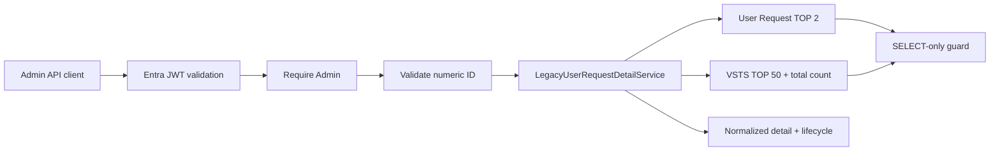

# Legacy User Request Detail API and Lifecycle

## Scope

Task 07I adds one live, read-only normalization path:

```http
GET /api/legacy/user-requests/{idSharepoint}
```

It reads the existing legacy SQL backups only. It does not call SharePoint or
Azure DevOps/VSTS APIs, write either source, use the Portal Prisma repositories,
create an audit row, migrate data, trigger Power Automate, or deploy anything.

The mandatory safety configuration remains unchanged:

```dotenv
LEGACY_INTEGRATION_MODE=READ_ONLY
ENABLE_SHAREPOINT_WRITE=false
ENABLE_LEGACY_SQL_WRITE=false
ENABLE_VSTS_WRITE=false
ENABLE_ACCESS_PROVISIONING=false
ENABLE_ACCESS_REVOCATION=false
ENABLE_AUTOMATION=false
```

## Request flow



Authentication and Admin authorization happen before input validation and
before lazy legacy service construction. The endpoint accepts no query
parameters, alternate identifier type, table, column, ordering, or SQL input.

## Identifier strategy and fail-closed uniqueness

The route parameter is normalized SharePoint `IDSharepoint`, not VSTS
`Work_ID` and not a future Portal request ID. Validation requires decimal digits
only and a value from 1 through the positive SQL `int` maximum. Leading zeroes
are accepted and normalized. Missing, zero, negative, decimal, oversized,
SQL-like, or otherwise malformed input returns HTTP 400.

The fixed SharePoint lookup:

- selects 14 reviewed columns explicitly from
  `[dbo].[All_SharepointUserRequest]`;
- binds the normalized identifier as `@idSharepoint`;
- binds `TOP (@detailLimit)` with the internal limit fixed at 2;
- compares against a safely converted, trimmed `IDSharepoint` value;
- passes through the existing SELECT-only guard.

Result handling is deliberately fail closed:

| Source rows | API result |
| ---: | --- |
| 0 | 404 `legacy_user_request_not_found` |
| 1 | Continue to related VSTS read |
| 2 | 409 `legacy_user_request_duplicate` |

The database still has no unique constraint, so the current snapshot's observed
uniqueness is not treated as a permanent invariant. The API never silently
chooses the first row.

## Related VSTS rows

After exactly one request row is found, the service reads related rows from the
fixed `[dbo].[All_Azure_Dev(VSTS)]` table using the confirmed request-origin
mapping to VSTS `IDSharepoint`. It does not call the Azure DevOps REST API.

The query selects only `Work_ID` and `State`, binds `@idSharepoint`, and binds a
maximum `@limit` of 50. `COUNT_BIG(*) OVER ()` reports the total matching backup
row count while SQL returns no more than 50 rows. Therefore truncation can be
reported without reading a sentinel row beyond the stated maximum.

Zero, one, or many related rows are valid. Duplicate Work IDs and null Work IDs
are not hidden:

- `sourceRowCount` is the total related VSTS backup row count;
- `returnedRowCount` is the number returned within the bound;
- `workItemCount` is the count of distinct normalized non-null Work IDs;
- `duplicateWorkItemIdCount` counts distinct Work IDs repeated in returned rows;
- `nullWorkItemIdCount` counts returned rows with no usable Work ID;
- `truncated` is true when more source rows exist than were returned.

The service does not pick a winner among duplicate rows or reconcile their
states.

## Normalized response

`LegacyUserRequestDetail` contains:

- `externalRequestId` and passive SharePoint-side `workItemId`;
- `company`, `department`, `country`, `system`, and `permission`;
- a `workflow` object with line-manager, CEO, IT-manager, VSTS, and OpenCase
  source values plus aggregate status comparison;
- preserved `createdDateText` and `updatedDateText`;
- bounded `relatedVstsItems`, each containing only normalized `workItemId`,
  trimmed `state`, and its comparison with SharePoint `StatusVSTS`;
- count-only relationship metadata;
- a derived lifecycle.

All source strings are trimmed and blank strings become null. Date columns on
the SharePoint backup remain text because their format and timezone are not
confirmed. The API does not return a raw database row.

## Lifecycle model

The response always orders these observational stages:

1. `REQUEST_CREATED`
2. `LINE_MANAGER_APPROVAL`
3. `CEO_APPROVAL`
4. `IT_MANAGER_APPROVAL`
5. `VSTS_WORK_ITEM`
6. `VSTS_STATE`
7. `REQUEST_UPDATED`

Each stage is `OBSERVED` or `UNAVAILABLE`. `UNAVAILABLE` does not mean skipped,
not required, rejected, or not applicable. Approval stages expose the trimmed
source value without translating its business meaning. Request dates remain
`dateText`. The VSTS Work Item stage contains only a distinct item count.

The VSTS State lifecycle value is returned only when all observed non-blank
states normalize to one distinct value. If multiple states are observed, the
stage remains `OBSERVED` with a null aggregate value; each state remains visible
on its related item. No overall completion or approval sequence is inferred.

## Status discrepancy policy

SharePoint `StatusVSTS` and every returned VSTS `State` remain separate fields.
Per-row comparison trims and compares case-insensitively:

| Condition | Result |
| --- | --- |
| Both values exist and agree | `MATCH` |
| Both values exist and differ | `MISMATCH` |
| Either value is missing | `UNKNOWN` |

The aggregate workflow comparison is `MISMATCH` when any observed comparable
row differs. It is `MATCH` only when at least one row matches, no row differs,
and the related result is not truncated. Otherwise it is `UNKNOWN`. This avoids
claiming agreement for rows outside a truncated response.

No value overwrites the other. No reconciliation, notification, or workflow is
triggered.

Task 07J aggregate discovery confirms that this noncommittal representation
must remain. Approval values are not universally present before related VSTS
work, `OpenCase` is not a one-to-one request/VSTS state, and mismatch timing
runs in both directions. See [Legacy Approval and Lifecycle Semantics](legacy-approval-lifecycle-semantics.md).

## Authorization and safe errors

| Condition | Result |
| --- | --- |
| Valid Admin access token | Allowed |
| Viewer or Approver without Admin | 403 |
| Missing or invalid token | 401 with Bearer challenge |
| Invalid path identifier/query input | 400 |
| Request not found | 404 |
| Duplicate request identifier | 409 |
| Legacy SQL/configuration unavailable | 503 |
| Internal safety invariant or unexpected failure | Sanitized 500 |

Every response uses `Cache-Control: no-store`. Logs contain only the fixed
endpoint code, safe result/error codes, count metrics, and status-comparison
code. They omit the requested ID, Work IDs, request fields, SQL text,
parameters, host/database/user details, credentials, tokens, authorization
headers, stack traces, and raw errors.

## Privacy and field omission

The SharePoint query omits `RequestEmail`, `CreateBy`, `LineManager`, `Assign`,
`TopicRequest`, `Detail`, `Servername`, `DBName`, `StorageName`, and `Tanant`.
The VSTS query omits `RequestEmail`, `CreateBy`, `Assign`, `Owner`, `Title`, and
`Description`. Omitting them at SQL projection is stronger than reading and
masking them.

Automated tests use synthetic rows and injected readers/drivers only. Normal
test, typecheck, and build commands do not connect to legacy SQL.

## Controlled production validation

After the full mocked suite passed, one candidate identifier was selected into
memory through a bounded, guarded SELECT and was never printed. The implemented
detail lookup returned `FOUND`; the bounded related-VSTS lookup reported 4
source rows; and normalized status comparison returned `MATCH`. No identifier,
request field, VSTS Work ID/state, employee information, raw row, SQL parameter,
or configuration value was printed, logged, persisted, or committed. The pool
was closed after the check and no write-capable system or API was contacted.

## Task 07J semantic boundary

Task 07J confirms that the API may describe recorded source observations, but
must not decide:

- whether CEO or IT Manager approval is required for a particular request;
- approval ordering, dependency, or finality;
- the complete vocabulary or meaning of any legacy approval status;
- which VSTS state means completed, failed, or closed;
- whether `OpenCase` is authoritative or how it maps to VSTS `State`;
- why SharePoint `StatusVSTS` and VSTS `State` sometimes differ;
- whether duplicate VSTS backup rows represent refresh history or data quality;
- legacy date format, timezone, or ordering across sources;
- whether SharePoint-side `Work_ID` is the primary item when several VSTS rows
  share one `IDSharepoint`.

The snapshot contradicts treating all approval fields as universally required,
`OpenCase` as an authoritative request state, multiple VSTS rows as exact
duplicates, or timestamp names as a strict lifecycle. The existing
`OBSERVED`/`UNAVAILABLE` DTO therefore remains unchanged.

## Recommendation for Task 07K

If separately approved, add only an Admin read view over this endpoint. Present
the lifecycle as source observations, list every related VSTS item, show
truncation and discrepancy explicitly, and leave date text unconverted. Do not
add completion, required-stage, primary-item, persistence, reconciliation, or
write semantics.
