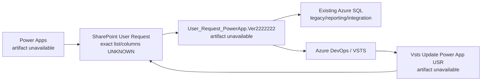
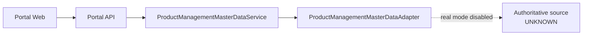
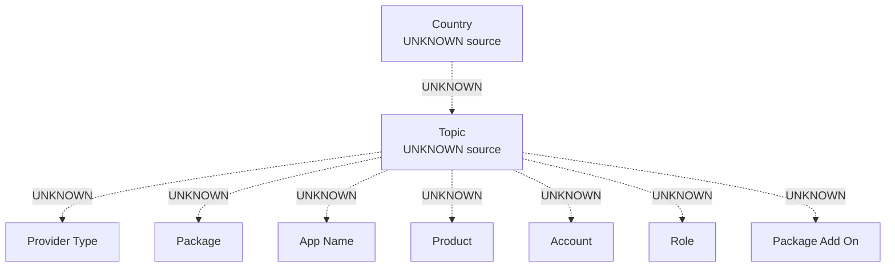

# Product Management master-data source discovery

## Scope and result

PM-02A is an offline, discovery-only review. It did not connect to production,
inspect ignored local credentials, change Power Apps or Power Automate, or change
Portal runtime behavior.

The requested exported `Product_Management`, `User_Request_PowerApp`,
`VstsUpdatePowerAppUSR`, and related flow packages are not present in the
repository or the available attachment cache. The cache contains only task text
and attachment metadata. A recursive inventory found no `.msapp`, package `.zip`,
unpacked Canvas app source, `dataSources.json`, Canvas manifest, or flow export.
Consequently, the package-inspection result is **FAIL (artifact unavailable)**,
not a failed parse, and no Power Apps control formula or connection reference can
be asserted from the available evidence.

This document records the bounded evidence that is available and leaves every
unproven mapping `UNKNOWN`. PM-02's real adapter remains fail closed.

## Evidence inspected

- Available attachment text and attachment metadata for PM-02 and PM-02A.
- Repository-wide tracked and untracked filename/content inventory for the
  requested app/flow names, Power Apps packages, unpacked source, formulas, data
  sources, and connection references.
- `docs/existing-system.md`
- `docs/product-management-mvp.md`
- `docs/legacy-sql-integration.md`
- `docs/legacy-user-request-vsts-relationship.md`
- `docs/access-catalog-legacy-mapping.md`
- `docs/approval-rule-legacy-mapping.md`
- `apps/api/src/product-management/mock-product-management.ts`
- `apps/api/src/product-management/product-management-master-data.ts`
- Existing fixed legacy SQL projections and allowlists under
  `apps/api/src/legacy/`.

No production query was made to supplement missing artifacts. Repository evidence
establishes candidate entity names and limited schema observations only; it does
not establish Power Apps bindings or business ownership.

## Architecture established by repository evidence

The repository documents the current production workflow at a system level:

This diagram is a repository-documented system relationship, not a
reverse-engineered control or connector graph. The intended Portal boundary
remains:

`PRODUCT_MANAGEMENT_DATA_SOURCE=real` still throws a configuration error. Mock
mode is synthetic local/test behavior and is not evidence about the existing app.

## Candidate data sources and connections

| Candidate | Connection type | Entity/list/table/view | Observed purpose | Read/write in existing app | Portal backend access/configuration | Authoritative Product Management master |
| --- | --- | --- | --- | --- | --- | --- |
| Existing Azure SQL | SQL | `dbo.MatrixProductManagement_new` | Approval/role-mapping matrix | UNKNOWN; app/flow export missing | A guarded read-only Legacy SQL connector exists, but PM master-data use is not mapped or enabled | NO for a complete master; exact mixed-purpose semantics remain UNKNOWN |
| Existing Azure SQL | SQL | `dbo.MatrixProductManagement_TH` | Approval/role-mapping matrix | UNKNOWN; app/flow export missing | Same as above | NO for a complete master; exact mixed-purpose semantics remain UNKNOWN |
| Existing Azure SQL | SQL | `dbo.MatrixProductManagement_PH` | Approval/role-mapping matrix | UNKNOWN; app/flow export missing | Same as above | NO for a complete master; exact mixed-purpose semantics remain UNKNOWN |
| Existing Azure SQL | SQL | `dbo.MatrixProductManagement_VN_MY_ID` | Approval/role-mapping matrix | UNKNOWN; app/flow export missing | Same as above | NO for a complete master; exact mixed-purpose semantics remain UNKNOWN |
| Existing Azure SQL | SQL | `dbo.All_SharepointUserRequest` | Request-history/reporting copy | UNKNOWN; app/flow export missing | Existing bounded read-only request APIs project approved columns; no PM master adapter is enabled | NO evidence that it is master data |
| SharePoint User Request | SharePoint (documented at system level) | Exact site/list name UNKNOWN | Production request record store | Read/write behavior is documented at workflow level; exact app operations UNKNOWN | No PM master-data connector/configuration is established | UNKNOWN |
| Other SharePoint/SQL/Dataverse source | UNKNOWN | UNKNOWN | Possible lookup/master source | UNKNOWN | UNKNOWN | UNKNOWN |

Power Apps connection names, connection reference IDs, environment-variable
bindings, and exact SharePoint/Dataverse entities are unavailable because the
exports are missing. Credentials were neither sought nor inspected.

### Verification of PM-02 candidates

The four `MatrixProductManagement_*` tables have the documented observed shape
`RoleName`, `Manager`, `Department`, and `Active`. Existing repository analysis
classifies them primarily as approval and role-mapping matrices and explicitly
prohibits treating them as a complete entitlement or master-data catalog.
Therefore:

- approval mapping: supported as the primary documented behavior;
- role mapping: supported as the primary documented behavior;
- complete Product Management master data: not supported;
- mixed purpose: possible but `UNKNOWN` without the app formulas and an owner
  confirmation.

`dbo.All_SharepointUserRequest.Country` and
`dbo.All_SharepointUserRequest.TopicRequest` are columns in a nullable request
history/reporting table with no discovered primary or unique key. They are
request-history observations only. No evidence shows they are fallback lists or
authoritative master data, so they must not seed the real adapter.

## Field trace

### Country

- Power Apps screen: `UNKNOWN`
- Control: `UNKNOWN`
- Items formula: `UNKNOWN`
- Data source: `UNKNOWN`; `All_SharepointUserRequest.Country` is history only
- Entity/List/Table/View: `UNKNOWN`
- Value column: `UNKNOWN`
- Display column: `UNKNOWN`
- Dependencies: root is expected by the Portal contract, but the existing-app
  dependency is `UNKNOWN`
- Filter: `UNKNOWN`
- Sort: `UNKNOWN`
- Authoritative: `UNKNOWN`

Missing evidence: Canvas screen/control source, `Items`/initialization formulas,
data-source definition, connection reference, and source-owner confirmation.
The field cannot be classified as hard-coded, collection-backed, master-backed,
history-derived, or another source.

### Topic

- Power Apps screen: `UNKNOWN`
- Control: `UNKNOWN`
- Items formula: `UNKNOWN`
- Data source: `UNKNOWN`; `All_SharepointUserRequest.TopicRequest` is history only
- Entity/List/Table/View: `UNKNOWN`
- Value column: `UNKNOWN`
- Display column: `UNKNOWN`
- Dependencies: Country is expected by the Portal contract; the existing-app
  relationship is `UNKNOWN`
- Filter: `UNKNOWN`
- Sort: `UNKNOWN`
- Authoritative: `UNKNOWN`

Missing evidence: Topic control, Country selection formula, `Filter`/`Distinct`/
`Choices`/collection formula, source schema, and owner confirmation. Thus the
complete Topic list and Country-to-Topic behavior cannot be established.

### Provider Type

- Power Apps screen/control/Items formula: `UNKNOWN`
- Data source/entity/value/display columns: `UNKNOWN`
- Dependencies/filter/sort: `UNKNOWN`
- Authoritative: `UNKNOWN`

Missing evidence: app control/formula, source and schema, dependency expression,
connection reference, and owner confirmation.

### Package

- Power Apps screen/control/Items formula: `UNKNOWN`
- Data source/entity/value/display columns: `UNKNOWN`
- Dependencies/filter/sort: `UNKNOWN`
- Authoritative: `UNKNOWN`

Missing evidence: app control/formula, source and schema, dependency expression,
connection reference, and owner confirmation.

### Package Add On

- Power Apps screen/control/Items formula: `UNKNOWN`
- Data source/entity/value/display columns: `UNKNOWN`
- Dependencies/filter/sort: `UNKNOWN`
- Authoritative: `UNKNOWN`

Missing evidence: app control/formula, source and schema, dependency expression,
connection reference, and owner confirmation.

### App Name

- Power Apps screen/control/Items formula: `UNKNOWN`
- Data source/entity/value/display columns: `UNKNOWN`
- Dependencies/filter/sort: `UNKNOWN`
- Authoritative: `UNKNOWN`

Missing evidence: app control/formula, source and schema, dependency expression,
connection reference, and owner confirmation.

### Product

- Power Apps screen/control/Items formula: `UNKNOWN`
- Data source/entity/value/display columns: `UNKNOWN`
- Dependencies/filter/sort: `UNKNOWN`
- Authoritative: `UNKNOWN`

Missing evidence: app control/formula, source and schema, dependency expression,
connection reference, and owner confirmation.

### Account

- Power Apps screen/control/Items formula: `UNKNOWN`
- Data source/entity/value/display columns: `UNKNOWN`
- Dependencies/filter/sort: `UNKNOWN`
- Authoritative: `UNKNOWN`

Missing evidence: app control/formula, source and schema, dependency expression,
connection reference, and owner confirmation.

### Role

- Power Apps screen: `UNKNOWN`
- Control: `UNKNOWN`
- Items formula: `UNKNOWN`
- Data source: `UNKNOWN`; `MatrixProductManagement_*` is a non-authoritative
  candidate with `RoleName`
- Entity/List/Table/View: authoritative entity `UNKNOWN`
- Value column: `UNKNOWN`
- Display column: `UNKNOWN`
- Dependencies/filter/sort: `UNKNOWN`
- Authoritative: `UNKNOWN`

Missing evidence: an actual Role control/formula binding, interpretation of
`RoleName`, source ownership, stable key/display fields, filters (including
`Active` semantics), and dependency logic. A matching label does not prove a
master-data relationship.

## Country, Topic, and lookup dependencies

No actual `Items`, `OnChange`, `OnSelect`, `Default`,
`DefaultSelectedItems`, `LookUp`, `Filter`, `Distinct`, `Choices`, `Sort`,
`Search`, `ClearCollect`, `Collect`, `Patch`, or `SubmitForm` formula was
available. The real dependency graph is therefore `UNKNOWN`:

The dotted edges are unresolved questions, not inferred relationships. The mock
dependency chain in `mock-product-management.ts` is synthetic test data and must
not be copied into a real adapter as production truth.

## Topic to screen/form mapping

No authoritative Topic list or target screen/form can be extracted. The Portal
mock topics `New Product` and `Product Change`, their fields, and their synthetic
Country support are not evidence of existing Power Apps behavior.

| Topic | Country support | Target screen/form | Primary controls | Dependent lookups | Submit destination/flow |
| --- | --- | --- | --- | --- | --- |
| `UNKNOWN` | `UNKNOWN` | `UNKNOWN` | `UNKNOWN` | `UNKNOWN` | `UNKNOWN` |

Missing evidence: app navigation formulas, screen definitions, control tree,
complete Topic source, form visibility logic, submit formula, and referenced flow
bindings. Topic-to-form mapping result is **FAIL (artifact unavailable)**.

## Required evidence and access for a future real adapter

Before implementing or enabling real mode, obtain an approved offline export of:

1. `Product_Management` and `User_Request_PowerApp` as `.msapp` or unpacked
   Canvas source, including control properties and `App.OnStart`/screen
   `OnVisible` formulas.
2. `User_Request_PowerApp.Ver2222222`, `VstsUpdatePowerAppUSR`, and related flow
   solution/package definitions, including sanitized connection references and
   environment-variable names.
3. Source definitions (`dataSources.json` or equivalent) and sanitized schemas
   for each referenced SharePoint list, SQL table/view, Dataverse entity, or
   custom connector.
4. Business-owner confirmation of authoritative entities, stable keys, display
   fields, Country/Topic coverage, dependency/filter semantics, lifecycle flags,
   and read/write ownership.
5. Separately approved, least-privilege read-only configuration for only the
   confirmed entities. Configuration availability must be verified without
   committing or documenting credential values.

Until all relevant mappings are resolved and approved, source mode must remain
`mock`; `real` must continue to fail closed.

## Recommended PM-02B approach

1. Unpack the approved exports offline and inventory screens, controls, formulas,
   data sources, connection references, variables, and flow bindings.
2. Produce a reviewed field-level mapping using exact formulas and source schema;
   keep unresolved fields unavailable rather than falling back silently.
3. Confirm source ownership and semantics with the Product Management owner,
   especially request-history versus master data and `RoleName`/`Active` meaning.
4. Add narrowly projected, allowlisted, bounded read ports behind the existing
   `ProductManagementMasterDataAdapter`; keep the Web dependent only on Portal API
   contracts.
5. Add synthetic contract, authorization, validation, error, and fail-closed
   tests before requesting a separately authorized real read smoke test.
6. Enable `PRODUCT_MANAGEMENT_DATA_SOURCE=real` only in an explicitly approved
   environment after configuration and acceptance evidence exists. This must not
   add production request writes, workflow invocation, or Power Automate changes.
