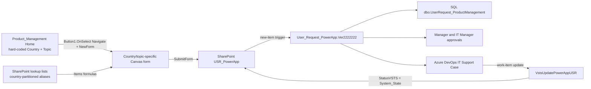
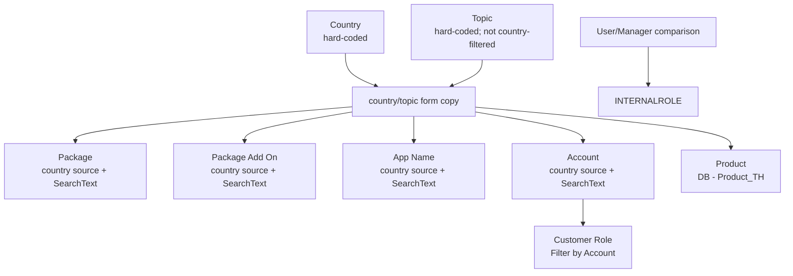

# Product Management master-data source discovery

## PM-02A-R2 result and evidence classification

PM-02A-R2 is an offline, discovery-only review of the exported Power Apps and
Power Automate packages. It did not connect to production, inspect credentials,
invoke a flow, submit a form, execute SQL, create a work item, or change Portal
runtime behavior.

This document uses three evidence classes:

- **CONFIRMED**: present directly in exported control properties, formulas,
  data-source metadata, or flow definitions.
- **INFERRED**: a bounded interpretation of confirmed structure, clearly labeled
  and not treated as business authority.
- **UNKNOWN**: not established by the exports; no mapping is invented.

All three requested packages were readable and structurally valid:

- `Product_Management_20260908084537.zip`: Canvas `.msapp`, unpacked `Src/*.pa.yaml`,
  `References/DataSources.json`, control metadata, and app metadata.
- `User_Request_PowerApp_Ver2222222.zip_20260901073156.zip`: flow definition,
  API map, and connection map.
- `VstsUpdatePowerAppUSR_20260902102608.zip`: flow definition, API map, and
  connection map.

The exports and temporary extracted files are under the ignored
`reference/legacy-product-management/` boundary. Git confirms that the ZIPs are
ignored and untracked. No export, extracted source, connection ID, environment
identifier, credential, or production row belongs in a commit.

## Architecture discovered

This is confirmed existing-system behavior. It does not authorize the Portal to
perform any of those writes. The Portal boundary remains
`Portal Web → Portal API → ProductManagementMasterDataService →
ProductManagementMasterDataAdapter`. `PRODUCT_MANAGEMENT_DATA_SOURCE=real`
continues to fail closed.

## Connections and source inventory

Every Canvas `ConnectedDataSourceInfo` in the export uses
`shared_sharepointonline`, even where the display name starts with `DB -`.
Those names must not be interpreted as direct SQL connections. The Canvas app
also uses `Office365Users` for the current user's display name and Department.

The User Request flow references `shared_sharepointonline`, `shared_sql`,
`shared_office365users`, `shared_approvals`, `shared_office365`, `shared_teams`,
and `shared_visualstudioteamservices`. The VSTS update flow references
`shared_visualstudioteamservices` and `shared_sharepointonline`. Connection IDs,
site URLs, list GUIDs, environment identifiers, and credentials are deliberately
not recorded.

### Country-partitioned SharePoint aliases

| Country | Package | Package Add On / hidden package | App | Account | Customer account-role | Internal role |
| --- | --- | --- | --- | --- | --- | --- |
| Thailand | `DB - vw_ListPackageStandard` | `DB - vw_ListPackagHidden` | `DB - SponsorApps_TH` | `DB - AccountName_EX_TH` | `DB - Account&Role_EX_TH` | `DB - MatrixProductManagement_TH` |
| Philippines | `DB - vw_ListPackageStandard PH` | `DB - vw_ListPackagHidden PH` | `DB - vw_SponsorAppsWithoutBPA_PH` | `DB - AccountName_EX_PH` | `DB - Account&Role_EX_PH` | `DB - MatrixProductManagement_PH` |
| Vietnam | `DB - vw_ListPackageStandard VN` | `DB - vw_ListPackagHidden VN` | `DB - vw_SponsorAppsWithoutBPA_VN` | `DB - AccountName_EX_VN` | `DB - Account&Role_EX_VN` | `DB - MatrixProductManagement_VN_MY_ID` |
| Malaysia | `DB - vw_ListPackageStandard MY` | `DB - vw_ListPackagHidden MY` | `DB - vw_SponsorAppsWithoutBPA_MY` | `DB - AccountName_EX_MY` | `DB - Account&Role_EX_MY` | `DB - MatrixProductManagement_VN_MY_ID` |
| Indonesia | `DB - vw_ListPackageStandard ID` | `DB - vw_ListPackagHidden ID` | `DB - vw_SponsorAppsWithoutBPA_ID` | `DB - AccountName_EX_ID` | `DB - Account&Role_EX_ID` | `DB - MatrixProductManagement_VN_MY_ID` |

`DB - Product_TH` supplies Product values on screens for all five countries.
This cross-country reuse is confirmed by formulas but its business ownership and
name semantics remain UNKNOWN.

## Country and Topic navigation

### Country — HARDCODED

- Power Apps screen: `Home`
- Control: `Dropdown1`
- Items formula:
  `=["","Thailand","Philippines","Vietnam","Malaysia","Indonesia"]`
- Value/display column: `Value`
- Filter/sort/dependency: none
- Authoritative: CONFIRMED for current app behavior; enterprise ownership UNKNOWN

The complete selectable Country list is:

1. Thailand
2. Philippines
3. Vietnam
4. Malaysia
5. Indonesia

Each country-specific form also contains a hidden SharePoint Choice control whose
`Items` is `Choices([@USR_PowerApp].Country)` and whose default is the country for
that screen. That control persists the selection; it is not the Home master list.

### Topic — HARDCODED

- Power Apps screen: `Home`
- Control: `Dropdown1_1`
- Value/display column: `Value`
- Filter/sort/dependency: none; the same list is shown for every Country
- Authoritative: CONFIRMED for current app behavior; enterprise ownership UNKNOWN

The exact selectable Topic list is:

1. `Create New Account (ลูกค้าใหม่)`
2. `เพิ่ม Email เข้า Account(ลูกค้า)`
3. `เพิ่ม Email(พนักงาน) เข้า Account(ลูกค้า)`
4. `เพิ่ม App เข้า Account(ลูกค้า)`
5. `ขอสิทธิ์เข้า Role(พนักงาน)`
6. `เพิ่ม App เข้า Role(พนักงาน)`
7. `เพิ่ม Permission เข้า Role(ลูกค้า)`
8. `เพิ่ม Package Add On(ลูกค้า)`
9. `Create New Role สำหรับ Account(ลูกค้า)`
10. `เปลี่ยน Provider สำหรับ Account(ลูกค้า)`
11. `Tranfer Owner Account(ลูกค้า)`
12. `ลบ User ใน Account(ลูกค้า)`
13. `ขอเปิด/ปิดแจ้งเตือนการเปลี่ยนสิทธิ์ถึง Owner Account`

`Button1.OnSelect` is one large `If` that compares both
`Dropdown1.Selected.Value` and `Dropdown1_1.Selected.Value`, then calls
`Navigate(<country/topic screen>) && NewForm(<form>)`. Country does not filter the
Topic dropdown; it selects the matching country copy of the form after the user
presses Next.

The formula contains a Thailand branch for `เพิ่ม Product เข้า Account(ลูกค้า)`,
and exported country screens with similar names exist, but that value is absent
from `Dropdown1_1.Items`. It is not selectable from Home and is therefore a stale
or unreachable candidate, not part of the confirmed Topic list.

## Field-level trace

`FOUND` below means the export directly identifies the source used by the
existing app. It does not by itself establish enterprise master-data ownership.

### Provider Type — FOUND, hard-coded per form

- Screens/controls: `ProviderType(Product)` or `ProviderType` cards;
  `Dropdown2*` and `Dropdown5*`
- Representative Items formula:
  `=["Select Providers Type","SAML","Office 365","Hotmail/Outlook","Google","Local Account"]`
- Values: `SAML`, `Office 365`, `Hotmail/Outlook`, `Google`, `Local Account`
- Display/value column: `Value`
- Dependencies: none; Account changes reset this control on change-provider and
  transfer-owner screens
- Persistence field: normally `USR_PowerApp.ProviderType(Product)`; some copied
  screens reuse `RoleName(Product)`
- Authoritative: CONFIRMED hard-coded app values; business authority UNKNOWN

Some Custom/Standard and older Email forms omit `SAML`. Provider options therefore
vary by form rather than coming from a single master entity.

### Package — FOUND

- Screens/controls: Create Account and Custom/Standard screens; `ComboBox2*`
- Data sources: country-specific `DB - vw_ListPackageStandard*`
- Entity type: SharePoint list alias from the Canvas export
- Value/display column: `DisplayName`; metadata also exposes `idSQL`, `Title`,
  and `Type`
- Representative formula:
  `SortByColumns(Filter(<country package source>, StartsWith(DisplayName,
  <control>.SearchText)), "DisplayName")`
- Dependencies: Country chooses the source through navigation; SearchText filters
  the source. No Provider Type dependency is present in the exported Items
  formulas.
- Persistence field: `USR_PowerApp.Package(Product)`
- Authoritative: operational source CONFIRMED; source ownership/lifecycle UNKNOWN

### Package Add On — FOUND

- Screens/controls: Create Account `PackageHid(Product)` and Add Package Add On
  `PackageAddon`; `ComboBox8*` or `ComboBox1*`
- Data sources: country-specific `DB - vw_ListPackagHidden*`
- Value/display column: `DisplayName`; metadata also exposes `idSQL`, `Title`,
  and `Type`
- Representative formula:
  `SortByColumns(Filter(<country hidden-package source>,
  StartsWith(DisplayName, <control>.SearchText)), "DisplayName")`
- Dependencies: Country/source partition and SearchText only. The dedicated
  Add-On form selects Account, filters Role by Account, and selects Add-On
  independently. No Package → Package Add On filter was found.
- Persistence fields: Create Account uses `PackageHid(Product)`; the dedicated
  Add-On form reuses `AppName(Product)` for the selected Add-On
- Authoritative: operational source CONFIRMED; source ownership/lifecycle UNKNOWN

### App Name — FOUND

- Screens/controls: Create Account, Add App to Account, and Add App to Role;
  `ComboBox1*`
- Thailand source: `DB - SponsorApps_TH`, using `AppNames` and `AppID`
- PH/VN/MY/ID sources: `DB - vw_SponsorAppsWithoutBPA_*`, using `AppName` or
  SharePoint `Title` plus `AppID`
- Representative formula:
  `SortByColumns(Filter(<country app source>, StartsWith(<display column>,
  <control>.SearchText)), "<display column>")`
- Dependencies: Country/source partition and SearchText. No Package → App filter
  was found.
- Persistence field: `USR_PowerApp.AppName(Product)`; some forms concatenate
  `[AppID] AppName`
- Authoritative: operational source CONFIRMED; source ownership/lifecycle UNKNOWN

### Product — FOUND

- Screens/controls: Custom Package, Add Product, and some Add App screens;
  `ComboBox2*`/`ComboBox6*`
- Data source: `DB - Product_TH` on screens for all countries
- Value/display column: `DisplayName`; metadata also exposes `Title`, `IsActive`,
  `IsInternalUse`, and `IsVisible`
- Representative formula:
  `SortByColumns(Distinct(Filter('DB - Product_TH', IsInternalUse=0),
  DisplayName), "Value", SortOrder.Ascending)`
- Dependencies: the observed filter is `IsInternalUse=0`; Country and Topic do
  not filter the list in this formula
- Persistence field: `USR_PowerApp.ProductName(Product)`
- Authoritative: operational source CONFIRMED; cross-country ownership and
  lifecycle rules UNKNOWN

### Account — FOUND

- Screens/controls: most account-oriented forms; `ComboBox3*` or `ComboBox7*`
- Primary data sources: country-specific `DB - AccountName_EX_*`
- Alternate source: `Distinct(<country DB - Account&Role_EX_*>, <account column>)`
- Value/display columns: `AccountName`; Malaysia exports also use misspelled
  `AcountName`; some account-role lists use SharePoint `Title` mapped to AccountName
- Representative formula:
  `SortByColumns(Filter(<country account source>, StartsWith(AccountName,
  <control>.SearchText)), "AccountName")`
- Dependencies: Country/source partition and SearchText
- Downstream dependency: changing Account resets Role/Provider controls; customer
  Role Items filter on the selected Account
- Persistence field: `USR_PowerApp.AccountName(Product)`
- Authoritative: operational source CONFIRMED; source ownership/lifecycle UNKNOWN

### Role — FOUND, two distinct contexts

Customer account-role:

- Controls: `ComboBox4*`, `ComboBox6*`, or `ComboBox2*`
- Data sources: country-specific `DB - Account&Role_EX_*`
- Value/display column: `AccountRoleName`; Account is `Title`, `AccountName`, or
  an exported localized alias depending on the country copy
- Representative formula:
  `Filter(<country account-role source>, <account column> =
  <account control>.Selected.<account column>)`
- Dependency: selected Account; `OnChange` resets Role
- Persistence field: normally `USR_PowerApp.RoleName(Product)`; the Add-On form
  reuses `ProductName(Product)` for this role value

Internal employee role:

- Controls: `ComboBox5*` in `RoleInternal(Product)` cards
- Data sources: `DB - MatrixProductManagement_TH`,
  `DB - MatrixProductManagement_PH`, or
  `DB - MatrixProductManagement_VN_MY_ID`
- Value/display column: SharePoint `Title`, mapped as `RoleName`
- Effective-route formula:
  `If(CountRows(Filter(<matrix>, User().Email=Manager)) > 0,
  Filter(<matrix>, User().Email=Manager), Filter(<matrix>, Manager=<fallback>))`
- Dependency: current user email as Matrix `Manager`, otherwise the directory
  Manager email. Department-filter formulas exist only on older non-routed copies.
  No effective `Items` formula applies `Active`, `Sort`, or `Distinct`.
- Persistence field: `USR_PowerApp.RoleInternal(Product)`

Both Role sources are operationally CONFIRMED. The export alone does not prove
that matrix `RoleName` is an authoritative entitlement or approval-routing label.
PM-03B resolves the Portal policy separately: it is candidate lookup metadata
only and grants neither entitlement nor approval authority.

## Confirmed dependency graph

Important negative findings from actual formulas:

- Country does not filter Topic; both are hard-coded.
- Provider Type does not filter Package.
- Package does not filter App Name.
- Package does not filter Package Add On.
- App Name does not filter Account or Role.
- Account does filter customer Role and Account changes reset dependent controls.
- Product is filtered by `IsInternalUse=0` in observed screens, not by Account,
  App, Package, Topic, or Country.

## Topic to screen/form mapping

All 13 selectable topics have explicit navigation branches for all five countries.
`{CC}` means `TH`, `PH`, `VN`, `MY`, or `ID`; Thailand sometimes uses a screen
without a trailing country suffix while the other copies use one.

| Topic | Target screen/form pattern | Important topic fields | Lookup dependencies | Submit |
| --- | --- | --- | --- | --- |
| `Create New Account (ลูกค้าใหม่)` | `{CC}_สร้างAccountลูกค้า` / country form | Company name, customer email, Provider Type, Package, App, hidden package | Country-specific Package/App/Add-On; no cross-filter among them | guarded `SubmitForm(Form*)` |
| `เพิ่ม Email เข้า Account(ลูกค้า)` | TH base; other `{CC}_..._{CC}` | Customer email, Provider Type, Account, customer Role | Account → Role | guarded `SubmitForm(Form*)` |
| `เพิ่ม Email(พนักงาน) เข้า Account(ลูกค้า)` | `{CC}_..._{CC}` | Account, customer Role | Account → Role | guarded `SubmitForm(Form*)` |
| `เพิ่ม App เข้า Account(ลูกค้า)` | TH base; other `{CC}_..._{CC}` | Account, App | Country-partitioned Account and App; no App filter by Account | guarded `SubmitForm(Form*)` |
| `ขอสิทธิ์เข้า Role(พนักงาน)` | TH base; other `{CC}_..._{CC}` | Internal Role | requester-as-Manager else requester-manager → matrix Role | guarded `SubmitForm(Form*)` |
| `เพิ่ม App เข้า Role(พนักงาน)` | TH base; other `{CC}_..._{CC}` | Internal Role, App | same Manager fallback → Role; country → App source | guarded `SubmitForm(Form*)` |
| `เพิ่ม Permission เข้า Role(ลูกค้า)` | TH base; other `{CC}_..._{CC}` | Account, customer Role, request detail | Account → Role | guarded `SubmitForm(Form*)` |
| `เพิ่ม Package Add On(ลูกค้า)` | TH base; other `{CC}_..._{CC}` | Account, customer Role, Add-On | Account → Role; Add-On independent of Package | guarded `SubmitForm(Form*)` |
| `Create New Role สำหรับ Account(ลูกค้า)` | `{CC}_Create New Role...` | Account, new Role text | Country → Account source | guarded `SubmitForm(Form*)` |
| `เปลี่ยน Provider สำหรับ Account(ลูกค้า)` | `{CC}_เปลี่ยน Provider...` | Account, hard-coded new Provider | Account change resets Provider | guarded `SubmitForm(Form*)` |
| `Tranfer Owner Account(ลูกค้า)` | `{CC}_Tranfer Owner...` | Account, new Provider-type choice, email text | Account change resets Provider choice | guarded `SubmitForm(Form*)` |
| `ลบ User ใน Account(ลูกค้า)` | `{CC}_ลบ User...` | Account and topic-specific text/detail | Country → Account source | guarded `SubmitForm(Form*)` |
| `ขอเปิด/ปิดแจ้งเตือนการเปลี่ยนสิทธิ์ถึง Owner Account` | `{CC}_ขอเปิด_ปิด...` | Account, hard-coded `เปิด`/`ปิด` choice | Account change resets choice | guarded `SubmitForm(Form*)` |

Every form has `DataSource: =USR_PowerApp`. Common hidden/default fields include
`Sysytem_="Product Management"`, `Type_ALL="Product Management"`,
`Topic_Request=<topic>`, the country Choice, requester identity/Department, and
request routing/detail text. This confirms dynamic, topic-specific schemas rather
than one generic form containing every lookup.

The `Tranfer Owner` form's actual controls collect Account, a Provider Type value,
and email text while reusing `RoleName(Product)` for the provider value. PMD-012
and PMD-013 preserve that Legacy compatibility shape: Provider retains the reused
Role field, while the email retains Customer Email semantics without identity or
ownership authority. PM-04 verifies the technical destinations; this does not
normalize or redesign the Portal domain.

## Confirmed submission and status workflow

The Canvas submit buttons validate topic-specific controls, call
`SubmitForm(Form*)`, and navigate to `Sucsess`; the SharePoint destination is
`USR_PowerApp`.

The User Request flow then confirms this Product Management branch:

1. `When_an_item_is_created` triggers from SharePoint and `Get_item` reads the
   request; Office 365 Users resolves the requester's manager.
2. `System` switches on `Sysytem_`; case `Product Management` is selected.
3. `Insert_row_(V2)_3` writes a normalized copy to
   `[dbo].[UserRequest_ProductManagement]`, including SharePoint ID, Topic,
   Country, App, Product, Account, customer/internal Role, provider, and Detail.
4. `Start_and_wait_for_an_approval_9` obtains manager approval; SharePoint and SQL
   manager status/date fields are updated. Rejection follows the notification and
   terminate branch.
5. After the manager check succeeds, `Create_a_work_item_3` creates an Azure
   DevOps `IT Support Case` correlated by the SharePoint ID.
6. SQL is updated with `WorkID`/open-case state; notifications run; SharePoint is
   updated with `Work_ID`, `OpenCaseVSTS=Complete`, and `StatusVSTS=New`.
7. `Start_and_wait_for_an_approval_10` obtains IT Manager approval and updates the
   corresponding SharePoint and SQL status/date fields.

These are writes performed by the existing production flow definition. PM-02A-R2
only inspected the offline package and did not execute or alter any action.

PM-04 rechecked the three formerly PARTIAL mappings across all five effective
country forms and this Flow branch. Create Account Add-On is written only to
`PackageHid(Product)` with the exact `" , "` delimiter and is absent from
`Detail`, the SQL insert, approval content, and VSTS. Change Provider and Transfer
Owner copy `RoleName(Product)` directly to SQL `RoleName` and also carry the same
Provider meaning in `Detail`. Transfer Owner Customer Email is an unbound input
serialized only in `Detail`, which flows unchanged to SQL `Detail` and the
approval/VSTS description; it is not the dedicated SQL `Email_Customer` value.

The VSTS update flow confirms:

1. Trigger `When_a_work_item_is_updated` watches work-item type
   `IT Support Case`.
2. The primary condition requires the title to contain both `Power App` and
   `User Request`.
3. `Custom_IDSharepoint` locates the related SharePoint item.
4. `Update_item` sets SharePoint `StatusVSTS` from VSTS `System_State`.

Additional title-pattern branches exist for other systems; they are outside this
Product Management mapping.

## Reconciliation with PM-02 mock

| Area | Result | Evidence |
| --- | --- | --- |
| Countries | **PARTIAL MATCH** | Mock has Thailand/Vietnam; export has Thailand, Philippines, Vietnam, Malaysia, Indonesia |
| Topics | **MISMATCH** | Mock `New Product`/`Product Change` do not match the 13 selectable exported topics |
| Dynamic schemas | **MISMATCH** | Mock exposes two generic schemas with all lookups; export has 13 topic-specific form shapes copied per country |
| Lookup dependencies | **MISMATCH** | Mock assumes Provider → Package, Package → Add-On/App, App → Account/Role; exports show Country source partition, Account → customer Role, and effective Manager-fallback → internal Role |

The mock remains valid synthetic contract/test data but is not a representation of
the exported production application's complete Country, Topic, form, or dependency
behavior.

## Reconciliation of earlier candidate sources

The Canvas export confirms that the `MatrixProductManagement_*` aliases are
directly used for internal Role selection. They are SharePoint connections in the
app export, with `Title` mapped to `RoleName` and fields `Manager`, `Department`,
and `Active`. Effective routed forms filter by requester-as-Manager with a
requester-manager fallback. Department filtering occurs only on older non-routed
copies. This proves dropdown candidate use, but not enterprise entitlement or
approval authority; their mixed business meaning remains UNKNOWN.

`All_SharepointUserRequest.Country` and `TopicRequest` remain request-history
observations and are not referenced as lookup masters by the Canvas app. The
actual submission store is the SharePoint `USR_PowerApp` source, and the flow
writes a downstream SQL row to `dbo.UserRequest_ProductManagement`. Neither is a
master-data source for Country or Topic.

## Remaining UNKNOWN items and anomalies

- SharePoint source ownership, maintenance, stable keys, and lifecycle/SLA remain
  technically and operationally unverified; PM-03B owner decisions do not make a
  source authoritative.
- Physical site/list IDs and credentials are intentionally not documented. Portal
  backend access to these SharePoint sources is not established.
- Names beginning `DB -` are SharePoint connections; whether they are synchronized
  from SQL, and by what process, is UNKNOWN.
- `DB - Product_TH` is reused for non-TH screens; intended country scope is UNKNOWN.
- Provider options differ between screen generations; the canonical set per topic
  requires business confirmation.
- Effective legacy Matrix Role formulas never apply `Active`. PM-03B separately
  approves the Portal policy: only `Active=true`, unknown Active fails closed,
  unusable Manager stays UNRESOLVED, duplicate ambiguity requires a stable key or
  fails closed, and deterministic display order conveys no approval priority.
- Several copied screens reuse semantically different `USR_PowerApp` fields, such
  as Add-On in `AppName(Product)`, customer Role in `ProductName(Product)`, and new
  Provider in `RoleName(Product)`. PM-03B approves preserving these specified
  compatibility mappings, and PM-04 verifies their technical downstream paths.
  Runtime integration remains separately disabled and unimplemented.
- Unreachable/stale Product screens and the Thailand-only navigation branch need
  owner confirmation before being considered supported Topics.
- Exact observed validation, multiplicity, requiredness, field reuse, and
  downstream mappings were completed in PM-03 and are recorded in the
  [legacy form contract](product-management-form-contract.md). The exports
  establish current implementation, not approved future Portal policy.

## Historical PM-02B recommendation and remaining follow-up

PM-02B implemented the mock/schema alignment described below. The source-ownership,
stable-key implementation, and real-adapter gates remain open. The ten PM-03B
owner-policy decisions are resolved, but runtime activation is not authorized.

1. Obtain technical/source-owner verification for remaining source-governance
   questions: stale screens, Provider option variants, cross-country Product
   source, source ownership, and stable keys before integration. PM-04 has closed
   the three requested downstream compatibility mappings only.
2. Decide whether PM-02B should read SharePoint aliases directly or a separately
   approved authoritative upstream source. Display names beginning `DB -` are not
   proof that SQL is the correct integration boundary.
3. Define stable value/display keys and explicit per-country source allowlists for
   Package, Add-On, App, Product, Account, customer Role, and internal Role.
4. Model dependencies from the export: Country/topic choose the schema/source;
   Account filters customer Role; Manager-fallback internal Role requires
   a separate authorization/privacy review and must not trust browser identity.
5. Add read-only connector ports behind the existing adapter with bounded
   projections, sanitized errors, API-authoritative authentication/authorization,
   synthetic tests, and no fallback from failed real reads to mock.
6. Keep production submission, SQL writes, approval, VSTS creation/status writes,
   Power Automate changes, and provisioning outside PM-02B unless separately and
   explicitly authorized.
7. Keep `PRODUCT_MANAGEMENT_DATA_SOURCE=real` disabled until source ownership,
   credentials/scopes, contracts, tests, and a separately approved read acceptance
   plan are complete.
